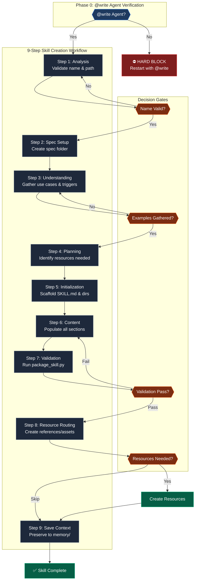

> ⚠️ **EXECUTION PROTOCOL — READ FIRST**
>
> This command runs a structured YAML workflow. Do NOT dispatch agents from this document.
>
> **YOUR FIRST ACTION:**
> 1. Run Phase 0: @write agent self-verification (below)
> 2. Run Setup Phase: consolidated prompt to gather inputs
> 3. Determine execution mode from user input (`:auto` or `:confirm`)
> 4. Load the corresponding YAML file from `assets/`:
>    - Auto mode → `create_skill_auto.yaml`
>    - Confirm mode → `create_skill_confirm.yaml`
> 5. Execute the YAML workflow step by step
>
> The @write references below are self-verification checks — not dispatch instructions.
> All content after the Setup Phase is reference context for the YAML workflow.

---

# 🚨 PHASE 0: @WRITE AGENT VERIFICATION

**STATUS: ☐ BLOCKED**

```
EXECUTE THIS AUTOMATIC SELF-CHECK (NOT A USER QUESTION):

SELF-CHECK: Are you operating as the @write agent?
│
├─ INDICATORS that you ARE @write agent:
│   ├─ You were invoked with "@write" prefix
│   ├─ You have template-first workflow capabilities
│   ├─ You load templates BEFORE creating content
│   ├─ You validate template alignment AFTER creating
│
├─ IF YES (all indicators present):
│   └─ write_agent_verified = TRUE → Continue to Setup Phase
│
└─ IF NO or UNCERTAIN:
    │
    ├─ ⛔ HARD BLOCK - DO NOT PROCEED
    │
    ├─ DISPLAY to user:
    │   ┌────────────────────────────────────────────────────────────┐
    │   │ ⛔ WRITE AGENT REQUIRED                                    │
    │   │                                                            │
    │   │ This command requires the @write agent for:                │
    │   │   • Template-first workflow (loads before creating)          │
    │   │   • DQI scoring (target: 90+ Excellent)                    │
    │   │   • sk-documentation skill integration               │
    │   │                                                            │
    │   │ To proceed, restart with:                                  │
    │   │   @write /create:skill [skill-name]                        │
    │   │                                                            │
    │   │ Reference: [runtime_agent_path]/write.md                   │
    │   └────────────────────────────────────────────────────────────┘
    │
    └─ RETURN: STATUS=FAIL ERROR="Write agent required"
```

**Phase Output:**
- `write_agent_verified = ________________`

---

# 🔒 UNIFIED SETUP PHASE

**STATUS: ☐ BLOCKED**

**🚨 SINGLE CONSOLIDATED PROMPT - ONE USER INTERACTION**

This workflow uses a SINGLE consolidated prompt to gather ALL required inputs in ONE user interaction.

**Round-trip optimization:** This workflow requires only 1 user interaction.

```
EXECUTE THIS SINGLE CONSOLIDATED PROMPT:

1. CHECK for mode suffix in $ARGUMENTS or command invocation:
   ├─ ":auto" suffix detected → execution_mode = "AUTONOMOUS" (pre-set, omit Q2)
   ├─ ":confirm" suffix detected → execution_mode = "INTERACTIVE" (pre-set, omit Q2)
   └─ No suffix → execution_mode = "ASK" (include Q2 in prompt)

2. CHECK if $ARGUMENTS contains a skill name (ignoring flags):
   ├─ IF $ARGUMENTS has content → skill_name = extracted value, omit Q0
   │   ├─ Extract --path flag if present (optional)
   │   ├─ VALIDATE skill name format:
   │   │   ├─ Must be hyphen-case (lowercase, hyphens, digits only)
   │   │   ├─ Must match folder name exactly
   │   │   ├─ No uppercase, underscores, or special characters
   │   │   └─ IF invalid: include Q0 in prompt with format guidance
   │   └─ Store output path as: skill_path (default: .opencode/skill/)
   └─ IF $ARGUMENTS is empty → include Q0 in prompt

3. Search for related spec folders:
   $ ls -d specs/*/ 2>/dev/null | tail -10

4. Determine if memory loading question is needed:
   - Will be asked ONLY if user selects A or C for spec folder AND memory/ has files
   - Include Q3 placeholder with note "(if using existing spec with memory files)"

5. ASK user with SINGLE CONSOLIDATED prompt (include only applicable questions):

   ┌────────────────────────────────────────────────────────────────┐
   │ **Before proceeding, please answer:**                          │
   │                                                                │
   │ **Q0. Skill Name** (if not provided in command):               │
   │    What skill would you like to create?                        │
   │    Format: hyphen-case (e.g., pdf-editor, api-client)          │
   │                                                                │
   │ **Q1. Spec Folder** (required):                                │
   │    A) Use existing: [suggest if related found]                 │
   │    B) Create new spec folder (Recommended)                     │
   │    C) Update related spec: [if partial match found]            │
   │    D) Skip documentation                                       │
   │                                                                │
   │ **Q2. Execution Mode** (if no :auto/:confirm suffix):            │
   │    A) Interactive - Confirm at each step (Recommended)          │
   │    B) Autonomous - Execute without prompts                     │
   │                                                                │
   │ **Q3. Memory Context** (if using existing spec with memory/):  │
   │    A) Load most recent memory file                              │
   │    B) Load all recent files, up to 3                            │
   │    C) Skip (start fresh)                                       │
   │                                                                │
   │    A) No (default — SKILL.md + assets/ + references/ only)    │
   │       (recommended for complex skills, 5+ topics)              │
   │                                                                │
   │ Reply with answers, e.g.: "B, A, C, A" or "pdf-editor, B, A"   │
   └────────────────────────────────────────────────────────────────┘

6. WAIT for user response (DO NOT PROCEED)

7. Parse response and store ALL results:
   - skill_name = [from Q0 or $ARGUMENTS]
   - skill_path = [from --path flag or default: .opencode/skill/]
   - spec_choice = [A/B/C/D from Q1]
   - spec_path = [derived path or null if D]
   - execution_mode = [AUTONOMOUS/INTERACTIVE from suffix or Q2]
   - memory_choice = [A/B/C from Q3, or N/A if not applicable]

8. Execute background operations based on choices:
   - IF spec_choice == B: Find next number and create: specs/[NNN]-[skill-name]/
   - IF memory_choice == A: Load most recent memory file
   - IF memory_choice == B: Load up to 3 recent memory files

9. SET STATUS: ✅ PASSED

**STOP HERE** - Wait for user to answer ALL applicable questions before continuing.

⛔ HARD STOP: DO NOT proceed until user explicitly answers
⛔ NEVER auto-create spec folders without user confirmation
⛔ NEVER auto-select execution mode without suffix or explicit choice
⛔ NEVER split these questions into multiple prompts
⛔ NEVER infer skill names from context, screenshots, or conversation history
```

**Phase Output:**
- `write_agent_verified = ________________`
- `skill_name = ________________`
- `skill_path = ________________`
- `spec_choice = ___` | `spec_path = ________________`
- `execution_mode = ________________`
- `memory_loaded = ________________`

---

## PHASE STATUS VERIFICATION (BLOCKING)

**Before continuing to the workflow, verify ALL values are set:**

| FIELD                | REQUIRED      | YOUR VALUE | SOURCE                 |
| -------------------- | ------------- | ---------- | ---------------------- |
| write_agent_verified | ✅ Yes         | ______     | Automatic check        |
| skill_name           | ✅ Yes         | ______     | Q0 or $ARGUMENTS       |
| skill_path           | ✅ Yes         | ______     | --path flag or default |
| spec_choice          | ✅ Yes         | ______     | Q1                     |
| spec_path            | ○ Conditional | ______     | Derived from Q1        |
| execution_mode       | ✅ Yes         | ______     | Suffix or Q2           |
| memory_loaded        | ○ Conditional | ______     | Q3 (if existing spec)  |

```
VERIFICATION CHECK:
├─ ALL required fields have values?
│   ├─ YES → Proceed to "⚡ INSTRUCTIONS" section below
│   └─ NO  → Re-prompt for missing values only
```

---

## INSTRUCTIONS

After Phase 0 and Setup Phase pass, load and execute the appropriate YAML workflow:

- **AUTONOMOUS (`:auto`)**: `.opencode/command/create/assets/create_skill_auto.yaml`
- **INTERACTIVE (`:confirm`)**: `.opencode/command/create/assets/create_skill_confirm.yaml`

The YAML contains: detailed step activities, checkpoints, confidence scoring, error recovery, validation gates, resource routing, and completion reporting.

---

> **📚 REFERENCE CONTEXT** — The sections below provide reference information for the YAML workflow. They are NOT direct execution instructions.

---

## CONSTRAINTS

- **DO NOT** dispatch any agent (`@context`, `@speckit`, `@review`) from this document
- **DO NOT** dispatch `@review` to review this workflow or command prompt
- **ALL** agent dispatching is handled by the YAML workflow steps — this document is setup + reference only
- **FIRST ACTION** is always: run Phase 0, then Setup Phase, then load the YAML file

---

## RUNTIME AGENT PATH RESOLUTION

Use `[runtime_agent_path]` based on the active runtime profile:

- Default/Copilot: `.opencode/agent`
- ChatGPT: `.opencode/agent/chatgpt`
- Claude: `/.claude/agents`

---

## 1. ROLE & PURPOSE

```yaml
role: Expert Skill Creator using sk-documentation skill
purpose: Create production-ready OpenCode skills with proper structure and validation
action: Guide skill creation from understanding through packaging with DQI verification and resource routing

operating_mode:
  workflow: sequential_9_step
  workflow_compliance: MANDATORY
  workflow_execution: interactive
  approvals: step_by_step
  tracking: progressive_task_checklists
  validation: checkpoint_based_with_dqi
  resource_routing: chained_command_execution
```

Create a complete, production-ready OpenCode skill following the 9-step skill creation process from the `sk-documentation` skill. The workflow ensures understanding before implementation, validates quality through DQI scoring, and offers intelligent resource recommendations with dynamic routing.

---

## 2. CONTRACT

**Inputs:** `$ARGUMENTS` — Skill name in hyphen-case with optional output path
**Outputs:** Complete skill folder with SKILL.md + resources + `STATUS=<OK|FAIL|CANCELLED>`

### User Input

```text
$ARGUMENTS
```

---

## 3. WORKFLOW OVERVIEW

**⛔ ENFORCEMENT RULE:** Execute steps IN ORDER (1→9). Mark each step ✅ ONLY after completing ALL its activities and verifying outputs. DO NOT SKIP STEPS.

| STEP | NAME             | STATUS | REQUIRED OUTPUT             | VERIFICATION                   |
| ---- | ---------------- | ------ | --------------------------- | ------------------------------ |
| 1    | Analysis         | ☐      | skill_name, skill_path      | Name validated, path confirmed |
| 2    | Spec Setup       | ☐      | specs/###-skill-name/       | Folder created                 |
| 3    | Understanding    | ☐      | Use cases, triggers         | Examples gathered              |
| 4    | Planning         | ☐      | Scripts, references, assets | Resources identified           |
| 5    | Initialization   | ☐      | SKILL.md template, dirs     | Structure scaffolded           |
| 6    | Content          | ☐      | SKILL.md, resources         | Files populated                |
| 7    | Validation       | ☐      | package_skill.py results    | All checks pass                |
| 8    | Resource Routing | ☐      | references/, assets/ files  | User chose, resources created  |
| 9    | Save Context     | ☐      | memory/*.md                 | Context preserved              |

---

## 4. MODE BEHAVIORS

**AUTONOMOUS (:auto):**
- Execute all steps without approval prompts
- Only stop for errors or missing required input
- Best for: Experienced users, scripted workflows, batch operations

**INTERACTIVE (:confirm):**
- Pause at each major step for user approval
- Show preview before file creation
- Ask for confirmation on critical decisions
- Best for: New users, learning workflows, high-stakes changes

**Default:** INTERACTIVE (creation workflows benefit from confirmation)

---

## 5. CRITICAL ENFORCEMENT RULES

```
STEP 3 (Understanding) REQUIREMENTS:
├─ MUST gather 3-5 concrete usage examples from user
├─ MUST identify trigger patterns (what users say)
├─ MUST define success criteria
└─ MUST NOT proceed without examples (blocks Step 4+)

STEP 6 (Content) REQUIREMENTS:
├─ MUST populate all SKILL.md sections
├─ MUST create bundled resources identified in Step 4
├─ MUST follow template structure from assets/
├─ MUST NOT leave placeholder text
├─ MUST include required sections: WHEN TO USE, HOW IT WORKS, RULES
├─ RULES section MUST have subsections: ALWAYS, NEVER, ESCALATE IF
├─ SECTION BOUNDARIES (CRITICAL):
│   ├─ "WHEN TO USE" = ONLY activation triggers, use cases, exclusions
│   │   └─ NO file references, NO navigation guides
│   └─ "SMART ROUTING" = Navigation Guide + Phase Detection + Resource Router
│       └─ ALL file/resource references go here
├─ SIZE CONSTRAINTS:
│   ├─ Max 5000 words (3000 recommended)
│   └─ Max 3000 lines

STEP 7 (Validation) REQUIREMENTS:
├─ MUST run package_skill.py --check before claiming complete
│   └─ Command: python .opencode/skill/sk-documentation/scripts/package_skill.py <skill-path> --check
├─ MUST pass all validation checks (frontmatter, sections, size)
├─ MUST NOT claim "complete" without validation pass
└─ MUST fix issues if validation fails

STEP 8 (Resource Routing) REQUIREMENTS:
├─ MUST analyze Step 3/4 outputs for resource recommendations
├─ MUST present recommendations with clear rationale
├─ MUST wait for explicit user choice (A/B/C/D)
├─ MUST execute selected resource creation via chained commands
├─ MUST NOT auto-create resources without user approval
└─ MUST NOT skip this step (user can choose "Skip" option)
```

---

## 6. WORKFLOW DIAGRAM



---

## 7. VIOLATION SELF-DETECTION (BLOCKING)

**YOU ARE IN VIOLATION IF YOU:**

**Phase Violations:**
- Executed command without @write agent verification
- Started reading the workflow section before all fields are set
- Asked questions in MULTIPLE separate prompts instead of ONE consolidated prompt
- Proceeded without asking user for skill name when not in $ARGUMENTS
- Auto-created or assumed a spec folder without user confirmation
- Auto-selected execution mode without suffix or explicit user choice
- Inferred skill name from context instead of explicit user input

**Workflow Violations (Steps 1-9):**
- Skipped understanding phase and jumped to initialization
- Created SKILL.md without gathering examples first
- Did not run validation scripts before claiming complete
- Claimed "complete" without DQI score verification
- Skipped resource recommendation (Step 8) and went straight to save context

**VIOLATION RECOVERY PROTOCOL:**
```
FOR PHASE VIOLATIONS:
1. STOP immediately - do not continue current action
2. STATE: "I asked questions separately instead of consolidated. Correcting now."
3. PRESENT the single consolidated prompt with ALL applicable questions
4. WAIT for user response
5. RESUME only after all fields are set

FOR WORKFLOW VIOLATIONS:
1. STOP immediately
2. STATE: "I skipped STEP [X] by [specific action]. Correcting now."
3. RETURN to the skipped step
4. COMPLETE all activities for that step
5. VERIFY outputs exist
6. MARK step ✅ in tracking table
7. CONTINUE to next step in sequence
```

---

## 8. REFERENCE TABLE

| Section             | Location in YAML                     |
| ------------------- | ------------------------------------ |
| Step Activities     | `workflow.steps[1-9].activities`     |
| Failure Recovery    | `failure_recovery`                   |
| Error Handling      | `error_handling`                     |
| Templates Used      | `templates_used`                     |
| Completion Report   | `completion_report_template`         |
| DQI Quality Bands   | `notes.dqi_quality_bands`            |
| Resource Categories | `notes.resource_categories`          |
| Resource Routing    | `workflow.steps[8]` (Step 8 details) |

---

## 9. EXAMPLES

**Example 1: Basic skill creation**
```
/documentation:create_skill pdf-editor
```
→ Creates skill at `.opencode/skill/pdf-editor/`
→ Skills auto-discovered from SKILL.md frontmatter
→ Appears as `skills_pdf_editor` function in OpenCode

**Example 2: Custom path**
```
/documentation:create_skill data-transformer --path ./my-skills
```
→ Creates skill at `./my-skills/data-transformer/`

**Example 3: Prompted creation**
```
/documentation:create_skill
```
→ Prompts: "What skill would you like to create?"

**Example 4: Auto mode (no prompts)**
```
/create:skill pdf-editor :auto
```
→ Creates skill without approval prompts, only stops for errors

**Example 5: Confirm mode (step-by-step approval)**
```
/create:skill pdf-editor :confirm
```
→ Pauses at each step for user confirmation

**Validation** (run after creation):
```bash
python .opencode/skill/sk-documentation/scripts/package_skill.py .opencode/skill/pdf-editor --check
```

---

## 10. COMMAND CHAIN

This command creates skills that may need additional resources:

```
/create:skill → [/create:skill_reference] and/or [/create:skill_asset]
```

**Explicit next steps:**
→ `/create:skill_reference [skill-name] [type]` (add technical reference docs)
→ `/create:skill_asset [skill-name] [type]` (add templates, lookups, examples)

---

## 11. NEXT STEPS

After skill creation completes, suggest relevant next steps:

| Condition                  | Suggested Command                               | Reason                          |
| -------------------------- | ----------------------------------------------- | ------------------------------- |
| Skill needs reference docs | `/create:skill_reference [skill-name] workflow` | Add technical workflows         |
| Skill needs templates      | `/create:skill_asset [skill-name] template`     | Add copy-paste templates        |
| Skill needs examples       | `/create:skill_asset [skill-name] example`      | Add working code examples       |
| Skill is complete          | Test with `/skill:[skill-name]`                 | Verify skill works              |
| Want to save context       | `/memory:save [spec-folder-path]`               | Preserve skill creation context |

**ALWAYS** end with: "What would you like to do next?"
