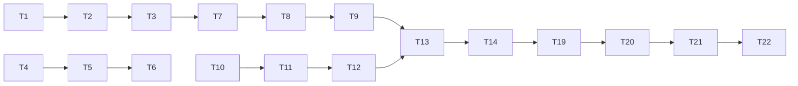

# Implementation Plan - Load Toggle Component

<!-- ANCHOR:overview -->
## Overview

This plan outlines the implementation of a reusable expand/collapse component for Webflow with CMS-bindable button text and multi-instance support.
<!-- /ANCHOR:overview -->

---

<!-- ANCHOR:phase-1-core-implementation -->
## Phase 1: Core Implementation 

### Objectives
- Create JavaScript component with toggle functionality
- Create CSS for visibility and animations
- Support multi-instance operation

### Tasks
| ID | Task | Est. | Actual |
|----|------|------|--------|
| T1 | Create JavaScript IIFE with state management | 2h | ✅ |
| T2 | Implement click handler with event delegation | 1h | ✅ |
| T3 | Add text update function | 30m | ✅ |
| T4 | Create CSS visibility rules | 30m | ✅ |
| T5 | Add icon rotation animation | 30m | ✅ |
| T6 | Add fade-in animation for expanded items | 30m | ✅ |
<!-- /ANCHOR:phase-1-core-implementation -->

---

<!-- ANCHOR:phase-2-cms-integration -->
## Phase 2: CMS Integration 

### Objectives
- Enable CMS-bindable button text
- Place attributes on button element (not container)

### Tasks
| ID | Task | Est. | Actual |
|----|------|------|--------|
| T7 | Move text attributes from container to button | 1h | ✅ |
| T8 | Update JavaScript to read from button | 30m | ✅ |
| T9 | Test with CMS collection items | 1h | ✅ |
<!-- /ANCHOR:phase-2-cms-integration -->

---

<!-- ANCHOR:phase-3-webflow-integration -->
## Phase 3: Webflow Integration 

### Objectives
- Ensure compatibility with Webflow page transitions
- Add proper cleanup for SPA navigation

### Tasks
| ID | Task | Est. | Actual |
|----|------|------|--------|
| T10 | Add Webflow.push integration | 30m | ✅ |
| T11 | Implement cleanup function | 30m | ✅ |
| T12 | Expose window.LoadToggle.cleanup() API | 15m | ✅ |
<!-- /ANCHOR:phase-3-webflow-integration -->

---

<!-- ANCHOR:phase-4-documentation -->
## Phase 4: Documentation 

### Objectives
- Create Webflow implementation guide
- Create Level 2 spec documentation

### Tasks
| ID | Task | Est. | Actual |
|----|------|------|--------|
| T13 | Create webflow-guide.md | 1h | ✅ |
| T14 | Create spec.md | 30m | ✅ |
| T15 | Create plan.md | 30m | ✅ |
| T16 | Create tasks.md | 30m | ✅ |
| T17 | Create checklist.md | 30m | ✅ |
| T18 | Create implementation-summary.md | 30m | ✅ |
<!-- /ANCHOR:phase-4-documentation -->

---

<!-- ANCHOR:phase-5-deployment -->
## Phase 5: Deployment

### Objectives
- Minify and deploy to CDN
- Test on staging site

### Tasks
| ID | Task | Est. | Status |
|----|------|------|--------|
| T19 | Minify JavaScript with terser | 15m | ✅ |
| T20 | Upload to Cloudflare R2 | 15m | Pending |
| T21 | Update version in Webflow | 15m | Pending |
| T22 | Test on staging site | 30m | Pending |
<!-- /ANCHOR:phase-5-deployment -->

---

<!-- ANCHOR:dependencies -->
## Dependencies

<!-- /ANCHOR:dependencies -->

---

<!-- ANCHOR:risk-assessment -->
## Risk Assessment

| Risk | Likelihood | Impact | Mitigation |
|------|------------|--------|------------|
| Button wrapper has conflicting attributes | Medium | High | Check for duplicate `data-target` in Webflow |
| Icon rotation not working | Low | Low | Verify icon has `data-target="load-icon"` |
| CMS binding not working | Medium | Medium | Ensure attributes on button, not wrapper |
| Memory leaks on navigation | Low | Medium | Cleanup function exposed for manual calls |
<!-- /ANCHOR:risk-assessment -->

---

<!-- ANCHOR:success-criteria -->
## Success Criteria

- [ ] Toggle works on click
- [ ] Expanded items show/hide correctly
- [ ] Button text updates based on state
- [ ] Icon rotates 180° on expand
- [ ] Multiple instances work independently
- [ ] CMS binding works for text attributes
- [ ] No console errors
- [ ] Works with Webflow page transitions
<!-- /ANCHOR:success-criteria -->
