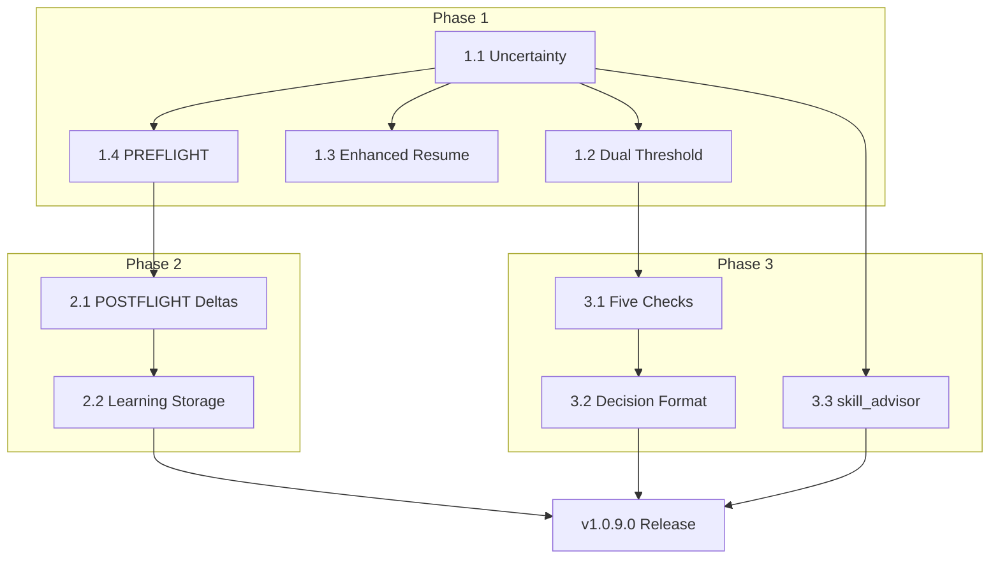

# Implementation Plan: SpecKit Upgrade from Research Consolidation

---

## Metadata

| Property | Value |
|----------|-------|
| **Plan Version** | 1.0.0 |
| **Target Release** | v1.0.7.0 → v1.0.9.0 (SpecKit System Upgrade) |
| **Estimated Effort** | 3-4 weeks |
| **Documentation Level** | Level 3+ |
| **Source Research** | 061, 063 |
| **Created** | 2026-01-22 |
| **Updated** | 2026-01-22 (Scope reduction) |

---

## Phase Overview Table

| Phase | Version | Items | Estimated Effort | Priority | Dependencies |
|-------|---------|-------|------------------|----------|--------------|
| **Phase 1: Core Epistemic** | v1.0.7.0 | 4 items | 1-2 weeks | P0 | None |
| **Phase 2: Learning Measurement** | v1.0.8.0 | 2 items | 1-2 weeks | P0 | Phase 1 |
| **Phase 3: Gate Enhancement** | v1.0.9.0 | 3 items | 1 week | P1 | Phase 1 |

---

## Visual Roadmap

```
                         SPECKIT UPGRADE IMPLEMENTATION ROADMAP
┌─────────────────────────────────────────────────────────────────────────────────────┐
│                                                                                     │
│  Week 1        Week 2        Week 3         Week 4                                 │
│    │             │             │              │                                     │
│    ▼             ▼             ▼              ▼                                     │
│  ┌───────────────────────────┐                                                     │
│  │      PHASE 1: v1.0.7.0    │                                                     │
│  │     Core Epistemic        │                                                     │
│  │  ─────────────────────────│                                                     │
│  │  [1] Uncertainty tracking │                                                     │
│  │  [2] Dual-threshold gate  │                                                     │
│  │  [3] Enhanced resume      │                                                     │
│  │  [4] PREFLIGHT baseline   │                                                     │
│  └───────────┬───────────────┘                                                     │
│              │                                                                      │
│              ▼                                                                      │
│            ┌───────────────────────────┐                                           │
│            │     PHASE 2: v1.0.8.0     │                                           │
│            │   Learning Measurement    │                                           │
│            │   ─────────────────────── │                                           │
│            │   [5] POSTFLIGHT deltas   │                                           │
│            │   [6] Learning storage    │                                           │
│            └───────────┬───────────────┘                                           │
│                        │                                                            │
│                        ▼                                                            │
│            ┌─────────────────────┐                                                  │
│            │  PHASE 3: v1.0.9.0  │                                                  │
│            │  Gate Enhancement   │                                                  │
│            │  ─────────────────  │                                                  │
│            │  [7] Five Checks    │                                                  │
│            │  [8] Decision format│                                                  │
│            │  [9] skill_advisor  │                                                  │
│            └─────────┬───────────┘                                                  │
│                      │                                                              │
│                      ▼                                                              │
│             ┌───────────────────┐                                                   │
│             │   RELEASE v1.0.9  │                                                   │
│             │   Full Upgrade    │                                                   │
│             └───────────────────┘                                                   │
│                                                                                     │
└─────────────────────────────────────────────────────────────────────────────────────┘
```

---

## Phase 1: Core Epistemic (v1.0.7.0)

**Target:** 1-2 weeks
**Priority:** P0
**Goal:** Establish uncertainty-aware confidence system with learning baselines

### 1.1 Uncertainty Tracking (P0)

**Source:** 061-system-upgrade-research-02 (Empirica)
**Rationale:** Prevent "confident ignorance" with explicit meta-layer tracking

**Implementation:**

Add separate uncertainty field (0.0-1.0) to confidence assessment:

```markdown
## AGENTS.md Section 4 Addition

### Uncertainty Assessment (NEW)

Separate from confidence, rate your uncertainty (0.0-1.0):

| Factor | Question | Weight |
|--------|----------|--------|
| Epistemic gaps | What don't I know about this? | 0.30 |
| Model boundaries | Am I at my capability limits? | 0.25 |
| Temporal variability | How stable is this knowledge? | 0.20 |
| Situational completeness | Is the context sufficient? | 0.25 |

**Uncertainty Score Calculation:**
uncertainty = (epistemic * 0.30) + (model * 0.25) + (temporal * 0.20) + (situational * 0.25)
```

**Files to Create/Modify:**
| File | Action | Description |
|------|--------|-------------|
| `AGENTS.md` (Section 4) | MODIFY | Add uncertainty assessment subsection |
| `references/epistemic-vectors.md` | CREATE | Full epistemic vector documentation |
| `scripts/validation/confidence-validator.js` | MODIFY | Add uncertainty validation |

**Acceptance Criteria:**
- [ ] Uncertainty tracked separately from confidence
- [ ] Uncertainty factors documented in AGENTS.md
- [ ] Validation script checks for uncertainty when confidence claimed

---

### 1.2 Dual-Threshold Validation (P0)

**Source:** 061-system-upgrade-research-02 (Empirica)
**Rationale:** Both knowledge AND low uncertainty required for readiness

**Gate Logic:**
```
READINESS = (know >= 0.70) AND (uncertainty <= 0.35)

If NOT READINESS:
  - know < 0.70: "Insufficient domain knowledge - investigate first"
  - uncertainty > 0.35: "Too much doubt - clarify before proceeding"
  - Both: "Both knowledge gap and high uncertainty - HARD BLOCK"
```

**Implementation in Gate 1:**
```markdown
### GATE 1: UNDERSTANDING + CONTEXT (Enhanced)

Thresholds:
- **know >= 0.70**: Sufficient domain understanding
- **uncertainty <= 0.35**: Acceptable doubt level

Combined check:
- BOTH pass → PROCEED
- know fails → INVESTIGATE (loop back max 3x)
- uncertainty fails → CLARIFY (ask specific questions)
- Both fail → HARD BLOCK with guidance
```

**Files to Create/Modify:**
| File | Action | Description |
|------|--------|-------------|
| `AGENTS.md` (Section 2) | MODIFY | Add dual-threshold to Gate 1 |
| `AGENTS.md` (Section 4) | MODIFY | Update confidence thresholds |
| `scripts/validation/gate-validator.js` | CREATE | Dual-threshold validation logic |

**Acceptance Criteria:**
- [ ] Gate 1 requires both thresholds
- [ ] Clear guidance when either threshold fails
- [ ] Maximum 3 investigation loops before user escalation

---

### 1.3 Enhanced Resume Detection (P1)

**Source:** 060-system-upgrade-research-01 (Smart-Ralph)
**Rationale:** Integrate state file priority for reliable resume

**Priority Order:**
1. Memory files with `status: active` anchor (highest priority)
2. Memory files < 24 hours old in spec folder
3. User-provided spec folder path
4. Last modified spec folder heuristic (fallback)

**Files to Create/Modify:**
| File | Action | Description |
|------|--------|-------------|
| `commands/resume.md` | MODIFY | Add memory-based detection logic with priority order |
| `scripts/detect-active-spec.js` | CREATE | Multi-source spec detection using memory signals |

**Acceptance Criteria:**
- [ ] Memory file with `status: active` anchor takes priority
- [ ] Graceful fallback through priority order
- [ ] Clear messaging about detection source

---

## Phase 2: Learning Measurement (v1.0.8.0)

**Target:** 1-2 weeks
**Priority:** P0
**Goal:** Track knowledge deltas to measure learning and calibrate future predictions

### 2.1 PREFLIGHT/POSTFLIGHT Pattern (P0)

**Source:** 061-system-upgrade-research-02 (Empirica CASCADE)
**Rationale:** Capture baseline before task, measure delta after completion

**Workflow:**
```
┌─────────────────────────────────────────────────────────────────────────────┐
│                        PREFLIGHT/POSTFLIGHT PATTERN                         │
└─────────────────────────────────────────────────────────────────────────────┘

        ┌──────────────┐
        │  PREFLIGHT   │  ← Task start: Capture baseline
        │  Baseline    │     - know: [current score]
        │  Assessment  │     - uncertainty: [current score]
        └──────┬───────┘     - timestamp: [now]
               │
               ▼
        ┌──────────────┐
        │    TASK      │  ← Normal task execution
        │  EXECUTION   │
        └──────┬───────┘
               │
               ▼
        ┌──────────────┐
        │ POSTFLIGHT   │  ← Task complete: Capture learned state
        │  Learning    │     - know: [updated score]
        │  Measurement │     - uncertainty: [updated score]
        └──────────────┘     - delta_know: +0.25
                             - delta_uncertainty: -0.30
```

**Files to Create/Modify:**
| File | Action | Description |
|------|--------|-------------|
| `scripts/learning/preflight.js` | CREATE | Capture baseline vectors |
| `scripts/learning/postflight.js` | CREATE | Calculate learning deltas |
| `commands/implement.md` | MODIFY | Add preflight/postflight hooks |
| `templates/memory-template.md` | MODIFY | Add PREFLIGHT/POSTFLIGHT sections |

**Acceptance Criteria:**
- [ ] Preflight captures baseline on task start
- [ ] Postflight calculates deltas on task completion
- [ ] Learning deltas logged to memory files
- [ ] Cumulative session learning tracked

---

### 2.2 Learning Deltas in Memory Files (P0)

**Source:** 061-system-upgrade-research-02 (Empirica)
**Rationale:** Store calibration data for improving future predictions

**Memory File Enhancement:**
```markdown
## ANCHOR: learning

### Session Learning Delta
| Metric | Preflight | Postflight | Delta |
|--------|-----------|------------|-------|
| know | 0.45 | 0.75 | +0.30 |
| uncertainty | 0.60 | 0.25 | -0.35 |
| completion | 0.20 | 0.85 | +0.65 |

### Calibration Insights
- Underestimated completion by 0.50 (typical bias)
- Domain knowledge increased significantly
- Uncertainty reduced through investigation
```

**Database Schema Addition:**
```sql
CREATE TABLE session_deltas (
  id INTEGER PRIMARY KEY,
  session_id TEXT NOT NULL,
  spec_folder TEXT,
  phase TEXT CHECK(phase IN ('preflight', 'postflight')),
  know_score REAL,
  uncertainty_score REAL,
  completion_score REAL,
  created_at TEXT NOT NULL,
  UNIQUE(session_id, phase)
);

CREATE TABLE learning_history (
  id INTEGER PRIMARY KEY,
  session_id TEXT NOT NULL,
  delta_know REAL,
  delta_uncertainty REAL,
  delta_completion REAL,
  task_description TEXT,
  created_at TEXT NOT NULL
);
```

**Files to Create/Modify:**
| File | Action | Description |
|------|--------|-------------|
| `mcp_server/migrations/003-learning-deltas.sql` | CREATE | Schema additions |
| `templates/memory-template.md` | MODIFY | Add learning anchor section |
| `scripts/generate-context.js` | MODIFY | Include learning deltas in output |

**Acceptance Criteria:**
- [ ] Learning deltas stored in database
- [ ] Memory files include learning anchor
- [ ] Cumulative calibration data accessible

---

## Phase 3: Gate Enhancement (v1.0.9.0)

**Target:** 1 week
**Priority:** P1
**Goal:** Enhance decision-making with Five Checks framework and structured decisions

### 3.1 Five Checks Framework (P1)

**Source:** 063-system-upgrade-research-04 (Superego)
**Rationale:** Systematic evaluation criteria for approach validation

**Five Checks:**
```markdown
## AGENTS.md Section 5 Addition: Five Checks Framework

Before proceeding with any approach, validate:

### CHECK 1: Necessary?
- Is this solving an ACTUAL need NOW, not hypothetical?
- Would a user notice if we skipped this?

### CHECK 2: Beyond Local Maxima?
- Have we explored alternative approaches?
- Are we picking "obvious" over "optimal"?

### CHECK 3: Sufficient?
- Is this the SIMPLEST approach that works?
- Are we over-engineering?

### CHECK 4: Fits Goal?
- Does this stay on the critical path?
- Are we solving scope creep?

### CHECK 5: Open Horizons?
- Does this align with long-term architecture?
- Are we creating technical debt?
```

**Files to Create/Modify:**
| File | Action | Description |
|------|--------|-------------|
| `AGENTS.md` (Section 5) | MODIFY | Add Five Checks subsection |
| `references/five-checks.md` | CREATE | Detailed framework documentation |
| `templates/decision-record.md` | MODIFY | Add Five Checks evaluation section |

**Acceptance Criteria:**
- [ ] Five Checks documented in AGENTS.md
- [ ] Decision records include Five Checks evaluation
- [ ] Clear guidance for each check

---

### 3.2 Structured Decision Format (P1)

**Source:** 063-system-upgrade-research-04 (Superego)
**Rationale:** Clear, auditable gate responses with confidence levels

**Format:**
```markdown
## Gate Response Format

GATE: [GATE_NAME]
DECISION: [PASS | BLOCK]
CONFIDENCE: [HIGH | MEDIUM | LOW]
EVIDENCE: [Specific justification with file:line citations]

[If BLOCK:]
RESOLUTION_PATH: [How to unblock]
ALTERNATIVE: [Suggested approach]
```

**Severity Levels:**
| Severity | Behavior | Override |
|----------|----------|----------|
| **HARD** | BLOCK if violated | No override |
| **SOFT** | BLOCK unless rationale provided | User can override |
| **ADVISORY** | WARN in feedback | Informational only |

**Files to Create/Modify:**
| File | Action | Description |
|------|--------|-------------|
| `AGENTS.md` (Section 2) | MODIFY | Add decision format to gates |
| `AGENTS.md` (Section 2) | MODIFY | Add severity levels |
| `references/decision-format.md` | CREATE | Detailed format documentation |

**Acceptance Criteria:**
- [ ] All gates use structured decision format
- [ ] Severity levels applied to existing gates
- [ ] BLOCK decisions require resolution path

---

### 3.3 skill_advisor.py Uncertainty Check (P1)

**Source:** 061-system-upgrade-research-02 (Empirica)
**Rationale:** Enhance skill routing with uncertainty consideration

**Enhancement:**
```python
# skill_advisor.py enhancement
def evaluate_skill_match(request, skill):
    base_confidence = calculate_confidence(request, skill)

    # NEW: Uncertainty penalty for ambiguous requests
    uncertainty = estimate_uncertainty(request)
    if uncertainty > 0.35:
        base_confidence *= (1 - uncertainty * 0.3)

    return {
        'skill': skill,
        'confidence': base_confidence,
        'uncertainty': uncertainty,
        'recommendation': 'invoke' if base_confidence >= 0.8 else 'consider'
    }
```

**Files to Create/Modify:**
| File | Action | Description |
|------|--------|-------------|
| `scripts/skill_advisor.py` | MODIFY | Add uncertainty calculation |
| `AGENTS.md` (Section 7) | MODIFY | Document uncertainty in routing |

**Acceptance Criteria:**
- [ ] skill_advisor.py includes uncertainty estimate
- [ ] High uncertainty reduces confidence score
- [ ] Output includes both confidence and uncertainty

---

## Dependencies & Prerequisites



### Prerequisite Checklist

| Item | Required For | Status |
|------|--------------|--------|
| Node.js 18+ | All scripts | Required |
| SQLite with sqlite-vec | Database migrations | Required |
| Existing MCP server | Phase 2 migrations | Required |
| AGENTS.md access | All documentation | Required |

---

## Critical Path

The critical path determines minimum timeline:

```
Week 1: 1.1 Uncertainty → 1.2 Dual Threshold → 1.4 PREFLIGHT
Week 2: 1.3 Enhanced Resume → 2.1 POSTFLIGHT Deltas
Week 3: 2.2 Learning Storage → 3.1 Five Checks
Week 4: 3.2 Decision Format → 3.3 skill_advisor → Release

CRITICAL PATH: 1.1 → 1.4 → 2.1 → 2.2 → Release (P0 items)
```

**Bottlenecks:**
1. Uncertainty tracking blocks dual-threshold and skill_advisor changes
2. PREFLIGHT blocks POSTFLIGHT delta storage
3. Five Checks blocks structured decision format

---

## Rollback Strategy

### Per-Phase Rollback

| Phase | Rollback Method |
|-------|-----------------|
| Phase 1 | Revert AGENTS.md Section 4 changes, remove uncertainty tracking |
| Phase 2 | Drop learning tables, remove ANCHOR sections from templates |
| Phase 3 | Revert AGENTS.md Section 5, restore original skill_advisor.py |

### Emergency Full Rollback

```bash
# Git-based rollback to pre-upgrade state
git checkout v1.0.6 -- .opencode/skill/system-spec-kit/
git checkout v1.0.6 -- AGENTS.md
git checkout v1.0.6 -- AGENTS.md

# Database rollback
sqlite3 context-index.sqlite < migrations/rollback-to-002.sql
```

### Rollback Triggers

Initiate rollback if ANY of:
- [ ] MCP server fails to start after migration
- [ ] Gate enforcement causes false positives >10% of attempts
- [ ] Memory save/search performance degrades >50%
- [ ] User reports critical workflow disruption

---

## Validation Checkpoints

### Phase 1 Validation

| Checkpoint | Validation Method | Pass Criteria |
|------------|-------------------|---------------|
| Uncertainty tracking | Review AGENTS.md Section 4 | Uncertainty field documented |
| Dual threshold | Test with low know (0.5), high uncertainty (0.6) | BLOCK with correct message |
| Enhanced resume | Start new session, run `/spec_kit:resume` | Uses memory files with priority order |
| PREFLIGHT capture | Start task, check memory output | PREFLIGHT section populated |

### Phase 2 Validation

| Checkpoint | Validation Method | Pass Criteria |
|------------|-------------------|---------------|
| PREFLIGHT capture | Start task, check memory output | PREFLIGHT section populated |
| POSTFLIGHT calculation | Complete task, check memory file | delta values calculated |
| Database storage | Query session_deltas table | Records exist with correct values |
| Memory file output | Generate memory, check learning anchor | Delta table rendered |

### Phase 3 Validation

| Checkpoint | Validation Method | Pass Criteria |
|------------|-------------------|---------------|
| Five Checks in output | Make decision, check response format | All 5 checks mentioned |
| Decision format | Block a gate, check message | DECISION/CONFIDENCE/EVIDENCE present |
| skill_advisor uncertainty | Test ambiguous request | Uncertainty score in output |

---

## Success Metrics

### Quantitative Goals

| Metric | Baseline | Target | Measurement |
|--------|----------|--------|-------------|
| Resume success rate | ~70% | >85% | Memory-based detection improvement |
| False positive blocks | N/A | <5% | Dual-threshold accuracy |
| Learning delta accuracy | N/A | Within 0.20 of actual | Postflight calibration |

### Qualitative Goals

- [ ] Users report improved resume reliability
- [ ] Decision audit trail useful for debugging
- [ ] Five Checks prevents over-engineering
- [ ] Uncertainty tracking improves confidence calibration

---

## Changelog

| Date | Version | Change |
|------|---------|--------|
| 2026-01-22 | 1.0.0 | Initial plan created from research consolidation |

---

*Plan generated from research specs 060, 061, 063 - Consolidated upgrade roadmap for system-spec-kit*
