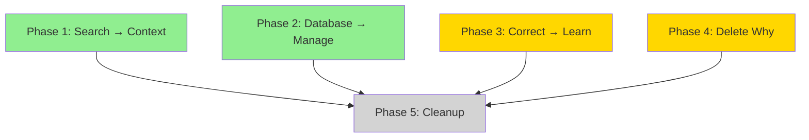

# Implementation Plan: Memory Command Consolidation

**Spec ID:** 083-memory-command-consolidation
**Created:** 2025-02-02
**Updated:** 2025-02-02

---

## Overview

Consolidate 9 memory commands into 5 through absorption, subcommands, and deletion.

```
┌─────────────────────────────────────────────────────────────────────┐
│                    CONSOLIDATION FLOW                               │
├─────────────────────────────────────────────────────────────────────┤
│                                                                     │
│  BEFORE (9)                    AFTER (5)                           │
│  ─────────                     ─────────                           │
│  /memory:context      ──────►  /memory:context  (+ search)         │
│  /memory:search       ──┘                                          │
│                                                                     │
│  /memory:save         ──────►  /memory:save                        │
│                                                                     │
│  /memory:continue     ──────►  /memory:continue                    │
│                                                                     │
│  /memory:learn        ──────►  /memory:learn    (+ correct)        │
│  /memory:correct      ──┘                                          │
│                                                                     │
│  /memory:why          ──────►  ❌ DELETED                          │
│                                                                     │
│  /memory:database     ──────►  /memory:manage   (+ checkpoint)     │
│  /memory:checkpoint   ──┘                                          │
│                                                                     │
└─────────────────────────────────────────────────────────────────────┘
```

---

## Phase 1: Search → Context Absorption (P0)

**Duration:** 1-2 days
**Risk:** Low (context already designed as superset)

### Tasks

1. **T1.1: Audit search.md patterns**
   - Document all argument patterns in search.md
   - Verify context.md handles each pattern
   - Identify any gaps

2. **T1.2: Add deprecation notice to search.md**
   ```yaml
   ---
   name: search
   deprecated: true
   deprecated-by: /memory:context
   deprecated-date: 2025-02-02
   ---
   ```

3. **T1.3: Create temporary alias**
   - When search is invoked, log deprecation warning
   - Forward to context with same arguments

### Deliverables
- [ ] search.md marked deprecated
- [ ] context.md verified complete
- [ ] Alias mechanism working

---

## Phase 2: Admin Consolidation (P0)

**Duration:** 2-3 days
**Risk:** Medium (requires subcommand routing)

### Tasks

1. **T2.1: Create manage.md from database.md**
   - Copy database.md as base
   - Rename command to `manage`
   - Add subcommand routing logic

2. **T2.2: Add checkpoint subcommands to manage**
   ```
   /memory:manage checkpoint create <name>
   /memory:manage checkpoint restore <name>
   /memory:manage checkpoint list
   /memory:manage checkpoint delete <name>
   ```

3. **T2.3: Deprecate originals**
   - Add deprecation notices to database.md
   - Add deprecation notices to checkpoint.md
   - Create forwarding aliases

### Deliverables
- [ ] manage.md created with full functionality
- [ ] checkpoint subcommands working
- [ ] database.md deprecated
- [ ] checkpoint.md deprecated

---

## Phase 3: Learning Consolidation (P1)

**Duration:** 2-3 days
**Risk:** Medium (complex workflow merge)

### Tasks

1. **T3.1: Add subcommand routing to learn.md**
   ```javascript
   // First argument determines mode
   if (args[0] === 'correct') → correctMode(args.slice(1))
   if (args[0] === 'undo') → undoMode(args.slice(1))
   if (args[0] === 'history') → historyMode()
   else → learnMode(args) // default
   ```

2. **T3.2: Implement correct subcommand**
   - Copy correction logic from correct.md
   - Adapt to subcommand context

3. **T3.3: Implement undo/history subcommands**

4. **T3.4: Deprecate correct.md**

### Deliverables
- [ ] learn.md with subcommand routing
- [ ] correct subcommand working
- [ ] correct.md deprecated

---

## Phase 4: Why Removal (P1)

**Duration:** 1 day
**Risk:** Low (user confirmed deletion)

### Tasks

1. **T4.1: Delete /memory:why command file**
   - Remove why.md from command folder

2. **T4.2: Update spec_kit references**
   - Update /spec_kit:plan (remove memory:why references)
   - Update /spec_kit:implement (remove from related commands)
   - Update /spec_kit:complete (remove from next steps)
   - Update /spec_kit:research (remove decision lineage references)
   - Update /spec_kit:debug (remove from related commands)

3. **T4.3: Clean up MCP dependencies**
   - Remove causal graph MCP tools if no longer used elsewhere

### Deliverables
- [ ] why.md deleted
- [ ] All spec_kit commands updated
- [ ] No broken references

---

## Phase 5: Cleanup (P2)

**Duration:** 1 day
**Risk:** Low (after transition period)

### Tasks

1. **T5.1: Remove deprecated files**
   - Delete search.md
   - Delete database.md
   - Delete checkpoint.md
   - Delete correct.md

2. **T5.2: Remove aliases**
   - Remove forwarding logic

3. **T5.3: Final documentation pass**
   - Verify all references updated
   - Update README/index files

### Deliverables
- [ ] All deprecated files removed
- [ ] Clean command namespace (5 files)

---

## Dependencies



**Legend:** P1, P2 can run in parallel. P3, P4 can run in parallel. P5 depends on all.

---

## Resource Allocation

| Phase | Effort | Priority |
|-------|--------|----------|
| Phase 1 | 4 hours | P0 |
| Phase 2 | 8 hours | P0 |
| Phase 3 | 8 hours | P1 |
| Phase 4 | 4 hours | P1 |
| Phase 5 | 2 hours | P2 |

**Total Effort:** ~26 hours (3-4 days)

---

## Rollback Plan

If consolidation causes issues:

1. **Immediate:** Restore deprecated files from git
2. **Short-term:** Remove forwarding aliases
3. **Long-term:** Revert to 9-command structure

All changes are reversible via git history.

---

## Success Criteria

| Criterion | Measurement |
|-----------|-------------|
| Command count reduced | 9 → 5 |
| All functionality preserved | 100% feature parity (except why) |
| No breaking changes | Aliases work during transition |
| Documentation updated | All references corrected |
| spec_kit commands updated | No broken why references |
