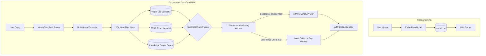

# Technical Analysis: The Unified Theory of Next-Generation RAG Systems (Final & Expanded)

<!-- ANCHOR:summary-unified-theory-138 -->
## 1. Executive Summary
This definitive analysis synthesizes architectural paradigms extracted from an exhaustive multi-agent research sprint across six distinct research threads (`research` through `research_6`). The core sources include the state-of-the-art `graphrag_mcp`, the resource-constrained powerhouse `WiredBrain-Hierarchical-Rag`, the enterprise giant `ragflow`, industry discussions on Tri-Hybrid engines, and a comprehensive 11,000+ LOC codebase deep-dive into the current `system-speckit` memory MCP server.

The central thesis of this analysis is that **the competitive edge in modern Retrieval-Augmented Generation (RAG) is no longer localized in the embedding model or the vector index size, but entirely in orchestration quality—how retrieval stages compose, adapt, and fuse.** As RAG matures into production systems, it continuously collides with three scaling limits: the "Lost in the Middle" phenomenon (where LLMs ignore context buried in large payloads), context window token saturation, and severe exact-match failures for structural metadata (like `REQ-006` or exact function names). 

While the `system-speckit` memory MCP server possesses an incredibly feature-rich foundation (Vector, FTS5, BM25, Reciprocal Rank Fusion, Causal Graphs, FSRS Decay, Intent Classification), it currently suffers from **integration fragmentation**. Advanced modules exist in isolation but are either feature-flagged, defaulted to off, or simply not wired into the primary search pipeline. This document dissects the interconnected patterns of next-generation context engines to forge a unified blueprint for activating, fusing, and scaling the `system-speckit` architecture.
<!-- /ANCHOR:summary-unified-theory-138 -->

<!-- ANCHOR:research-system-architecture-138 -->
## 2. System Architecture Overview: The Orchestrated RAG Pipeline

The modern RAG architecture abandons the monolithic, single-pass "embed -> cosine similarity -> generate" pipeline. Instead, systems treat retrieval as a Directed Acyclic Graph (DAG) of specialized engines orchestrated by a central context server (often operating over MCP).

### 2.1 The Architectural Paradigm Shift (Mermaid)

### 2.2 The Disconnected Tri-Hybrid Engine
The consensus across `WiredBrain` and production RAG models proves that two engines (Vector + Keyword) are insufficient for complex codebase or memory data.
*   **The Paradigm:** A Tri-Hybrid pipeline merges SQL Filtering (Structure), Vector Search (Meaning), and Sparse Search (Precision via BM25/FTS5).
*   **The Reality in `system-speckit`:** The MCP server successfully implements Vector (via `sqlite-vec`), FTS5, and in-memory BM25. However, it relies on static, hardcoded weights (`vector=1.0, FTS=0.8, BM25=0.6`). An advanced intent-aware dynamic weighting system (`adaptive-fusion.ts`) exists within the codebase but is isolated behind a feature flag and physically disconnected from the main pipeline. 

### 2.3 Hierarchical Addressing vs. Keyword Intent Pre-Routing
`WiredBrain-Hierarchical-Rag` achieved a staggering 13x latency reduction and 99.9% search space reduction by implementing a **4-Level Hierarchical Address System** `<Gate, Branch, Topic, Level>`.
*   **The Mathematics of Pre-Routing:** Vector search is theoretically O(N) or O(log N) with HNSW indices. But by applying a hard SQL `WHERE gate = 'backend'` filter, N drops from 693,000 to 20,000 *before* any distances are calculated. An ultra-fast (<50ms) SetFit neural classifier infers the user's intent and routes the query.
*   **The Reality in `system-speckit`:** The system uses a fast (<1ms) keyword and regex-based `intent-classifier.ts` across 7 intents. While adequate for the current corpus size, it lacks the embedding-based prototype matching of neural classifiers. More importantly, the system underutilizes the `spec_folder` metadata as a hierarchical pre-filter, risking "context collision" as the memory bank scales.

### 2.4 Knowledge Graph (KG) Expansion as a First-Class Citizen
Systems like `graphrag_mcp` and `WiredBrain` demonstrate that semantic similarity entirely lacks relational awareness. A vector search knows that "Auth Guard" and "Login Controller" are related mathematically, but it does not know that "Auth Guard *superseded* Login Controller."
*   **Architecture:** Vector storage (Qdrant/SQLite) is tightly coupled with Graph storage (Neo4j or PostgreSQL/SQLite relational tables). Vector searches yield nodes, which immediately trigger 1-hop or 2-hop edge traversals.
*   **The Reality in `system-speckit`:** The server contains a rich causal graph (`causal-edges.ts` handles 6 relationship types and 2-hop traversal via SQLite recursive CTEs). However, `useGraph` defaults to `false` in the primary search pipeline. Furthermore, causal boosts are only applied *post-retrieval*, acting as a multiplier on existing results. The graph is NOT used as a primary retrieval source fed into RRF. If Memory A caused Memory B, but Memory B has zero keyword overlap with the prompt, Memory B will remain invisible.
<!-- /ANCHOR:research-system-architecture-138 -->

<!-- ANCHOR:research-fusion-mechanics-138 -->
## 3. Core Logic Flows and Fusion Mechanics

### 3.1 The Mathematical Necessity of Reciprocal Rank Fusion (RRF)
When fusing SQL, BM25 (TF-IDF), and Vector (Cosine) scores, raw normalization (e.g., Min-Max scaling) fails catastrophically. Cosine similarities are bounded [-1, 1] and usually cluster tightly between 0.6 and 0.85 for modern embeddings. TF-IDF/BM25 scores are unbounded [0, ∞) and heavily skewed by document length. 

RRF bypasses score incompatibility entirely by stripping absolute values and scoring based purely on ordinal rank: 
`RRF_Score(d) = Σ (1 / (k + rank_i(d)))`
*   The constant `k` (usually 60) acts as a mathematical dampener, preventing extreme outlier volatility. If `k` is too low, the top result from a single source dominates. If `k=60`, consistent top-15 performers across multiple sources accumulate massive scores, bubbling to the top as high-confidence "consensus" matches.

### 3.2 Query-Independent Authority (PageRank)
Semantic relevance answers "Does this match the query?" but fails to answer "Is this document important?" 
*   **The Paradigm:** `ragflow` and `WiredBrain` utilize PageRank or In-Degree metrics on their graph edges to generate a static, query-independent authority score. A memory that is cited by 15 other memories (e.g., a core architectural decision) is inherently more valuable than an isolated note.
*   **The Reality in `system-speckit`:** All memories are weighted equally by RRF regardless of their structural importance in the causal graph. The system lacks an authority bias.

### 3.3 Field-Weighted Sparse Search
*   **The Paradigm:** `ragflow` radically improves keyword precision by assigning field-specific multipliers (e.g., `title^10`, `important_kwd^30`, `content^2`). A match on a title is intrinsically more valuable than a passing mention in paragraph 12.
*   **The Reality in `system-speckit`:** The server uses standard RRF with a convergence bonus, but its SQLite FTS5 queries treat all columns equally. A `bm25(..., 10.0, 5.0, 1.0, 2.0)` natively weighted query in SQLite would immediately elevate title and `trigger_phrases` matches without any architectural overhaul or latency increase.

### 3.4 Diversity (MMR) vs. Heuristics
*   **The Problem:** The LLM context window is strictly finite (budgeted at ~2000 tokens for the `system-speckit` MCP). Returning 5 highly-ranked, mathematically perfect, but completely redundant versions of the same implementation summary wastes 80% of this budget.
*   **The MMR Solution:** Maximal Marginal Relevance reranks documents by penalizing redundancy. 
    `ArgMax [ λ * Sim(Candidate, Query) - (1 - λ) * Max_Sim(Candidate, Selected) ]`
    The parameter `λ` biases the selection toward relevance (high `λ`) or diversity (low `λ`).
*   **The Reality in `system-speckit`:** The system relies on a heuristic proxy for diversity (`apply_diversity()` penalizes documents in the same `spec_folder` or sharing a date proximity). It lacks true post-fusion MMR based on actual embedding cosine similarity, leaving the token budget highly vulnerable to redundant data.
<!-- /ANCHOR:research-fusion-mechanics-138 -->

<!-- ANCHOR:research-design-patterns-138 -->
## 4. Design Patterns and Architectural Decisions

### 4.1 The Transparent Reasoning Module (TRM) "Glass Box"
A critical safety pattern extracted from `WiredBrain`. Most RAG systems suffer from "silent failure"—if a user asks an obscure question, the vector database returns the top 5 nearest neighbors regardless of actual relevance. The LLM, assuming the context is factual, hallucinates an answer based on noise.
*   **Gaussian Confidence Check (GCC):** The TRM analyzes the distribution (Mean and Standard Deviation) of the RRF retrieval scores. If the top match score falls below a dynamically computed Z-score threshold (an "Evidence Gap"), the system intercepts the pipeline.
*   **The Fallback:** It explicitly instructs the LLM via prompt injection: `[EVIDENCE GAP DETECTED: Low confidence match. Synthesize from first principles or use web search tools.]` This guarantees integrity over speed, proving essential for rigorous coding agents.
*   **The Reality in `system-speckit`:** There is no read-time confidence gating. It possesses a write-time contradiction detection via the `prediction-error-gate.ts`, but read-time retrieval confidence is missing entirely.

### 4.2 Structure-Aware Document Parsing
*   **The Paradigm:** `ragflow` abandons the naive sliding-window text chunker (e.g., 512 tokens with 50 overlap). It uses vision models and markdown parsers to respect structural boundaries. A chunk should never slice a table or a code block in half. 
*   **The Reality in `system-speckit`:** The system relies heavily on `<!-- ANCHOR -->` tags, which is excellent. However, fallback extraction could benefit heavily from `remark` + `remark-gfm` syntax tree parsing to ensure raw markdown code blocks remain mathematically contiguous when embedded.

### 4.3 Adaptive Fallback Thresholds
*   **The Paradigm:** `ragflow` implements a two-pass retrieval heuristic. If an initial strict search (`min_match=0.3`) returns 0 results, the orchestrator catches the empty array, relaxes the thresholds (`min_match=0.1`), and retries. This simple mechanism eradicates the frustrating "no results found" failure mode for highly specific or niche queries.

### 4.4 Query Expansion and Spreading Activation
*   **The Paradigm:** RAG Fusion multiplies queries to overcome prompt fragility. If a user asks "How to fix login error," expanding it to ["authentication fallback", "session timeout bug", "login error handler"] yields a dramatically wider, more robust vector net.
*   **The Reality in `system-speckit`:** There is zero server-side query expansion. Furthermore, a fully functional `co-activation.ts` spreading activation module (simulating human memory association networks) exists in the codebase but is never called in the search path.
<!-- /ANCHOR:research-design-patterns-138 -->

<!-- ANCHOR:discovery-key-learnings-138 -->
## 5. Key Learnings and The Path Forward

1.  **Integration Over Implementation:** The `system-speckit` MCP server does not need massive new external dependencies (like Neo4j or Elasticsearch). It needs its existing, disconnected features wired into the primary search pipeline. Activating adaptive fusion, graph channels, and spreading co-activation yields massive ROI with minimal code footprint.
2.  **Redundancy is the Enemy:** True post-fusion MMR is mandatory for token-constrained systems. Sending 5 highly similar memories is catastrophically wasteful to the context window and dilutes LLM attention.
3.  **Confidence is Not Optional:** Silent failure is the primary cause of LLM hallucination in RAG systems. Implementing a TRM Evidence Gap detection mechanism allows the LLM to degrade gracefully to first-principles reasoning when context is poor.
4.  **Authority Matches Semantic Similarity:** Context search must move beyond pure cosine similarity. Integrating PageRank-like scores from the causal graph and field-specific multipliers via FTS5 creates a "Quality-Weighted" retrieval system that surfaces the *right* answer, not just the closest text.
<!-- /ANCHOR:discovery-key-learnings-138 -->