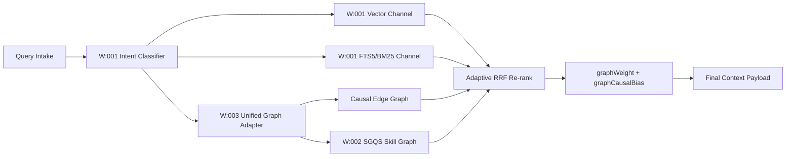

# Implementation Plan: Unified Graph-RAG Intelligence Integration

<!-- SPECKIT_LEVEL: 3+ -->
<!-- SPECKIT_TEMPLATE_SOURCE: plan-core | v2.2 -->

---

<!-- ANCHOR:summary -->
## 1. SUMMARY

### Technical Context

| Aspect | Value |
|--------|-------|
| **Language/Stack** | TypeScript (Node.js), SQLite (v15 schema), FTS5 |
| **Framework** | Spec Kit Memory MCP / OpenCode Skills System |
| **Storage** | SQLite DB (`sqlite-vec` embeddings, causal edge CTEs, FTS5 BM25 index) |
| **Testing** | vitest (unit + integration), console.time (performance benchmarks) |

### Overview

This plan covers the integration of Workstream A (RAG Fusion / `001-system-speckit-hybrid-rag-fusion`) and Workstream B (Skill Graphs / `002-skill-graph-integration`) into a unified, third search channel. A composite `graph-search-fn.ts` function bridges the SGQS skill graph and causal-edge graph into the existing scatter-gather pipeline through the already-defined but unused third argument of `hybridSearch.init()`. The integration operates behind feature flags, requires no SQLite schema migrations, and delivers sub-15ms graph channel latency within the 120ms total pipeline budget. Phase 0+ delivers the core wiring (highest ROI, ~7h). Phase 1+ adds observability and intent routing (~4h). Phase 2+ adds optional optimisation patterns conditioned on Phase 1 metrics (~6h).
<!-- /ANCHOR:summary -->

---

<!-- ANCHOR:quality-gates -->
## 2. QUALITY GATES

### Definition of Ready
- [x] Problem statement clear and scope documented
  - Evidence: `spec.md` (this subfolder) captures the integration boundary: wire graph channel, validate metrics, then optimise.
- [x] Success criteria measurable
  - Evidence: Three milestone gates defined with binary pass/fail signals (non-empty results, >15% hit rate, p95 latency).
- [x] Dependencies identified
  - Evidence: Workstream B SGQS graph confirmed available; `hybridSearch.init()` third-arg signature confirmed present but unused; v15 schema confirmed stable.

### Definition of Done
- [x] `graph-search-fn.ts` created and unit-tested
  - Deliverable: File at `mcp_server/lib/search/graph-search-fn.ts`, vitest suite passing.
  - Validation: Unit tests cover empty-result path (flag=false), normal path (both graph sources), and namespace-collision guard.
- [x] `SkillGraphCacheManager` implemented with 5-min TTL
  - Deliverable: Singleton class wrapping `buildSkillGraph()`, cache hit/miss metrics logged.
  - Validation: Cache hit does not re-read 72 markdown files; cold miss completes within 150ms.
- [x] Graph channel wired in `context-server.ts`, `db-state.ts`, and `reindex-embeddings.ts`
  - Deliverable: `createUnifiedGraphSearchFn(database, skillRoot)` passed as third argument to `hybridSearch.init()`.
  - Validation: Integration test with `SPECKIT_GRAPH_UNIFIED=true` returns non-empty graph results for known test queries.
- [x] `graphWeight` and `graphCausalBias` added to all 6 adaptive fusion profiles
  - Deliverable: Updated `FusionWeights` interface in `adaptive-fusion.ts` with graph-specific fields.
  - Validation: All existing fusion profile tests pass; new weights readable per intent class.
- [x] Co-activation spreading result captured (not discarded) at `hybrid-search.ts`
  - Deliverable: Return value stored and forwarded into the fusion merge step.
  - Validation: Test confirms spreading affects final ranked output when graph channel active.
- [x] Feature flags `SPECKIT_GRAPH_UNIFIED`, `SPECKIT_GRAPH_MMR`, `SPECKIT_GRAPH_AUTHORITY` defined
  - Deliverable: Env-var flags documented in `graph-flags.ts` with rollout-policy opt-out semantics (unset/empty/`true` enabled; explicit `false` disabled).
  - Validation: All tests pass with flags set to `false` (regression baseline preserved).
- [x] p95 latency with graph channel active <= 120ms
  - Deliverable: vitest performance suite output.
  - Validation: 50-query benchmark run against realistic corpus; p95 recorded and <= 120ms.
<!-- /ANCHOR:quality-gates -->

---

<!-- ANCHOR:architecture -->
## 3. ARCHITECTURE

### Pattern

Scatter-Gather Pipeline with Graph Channel Extension. The existing pipeline is a parallel scatter across Vector Search and FTS5 BM25, merged via Adaptive RRF Fusion. This integration adds a third scatter arm (graph channel) that runs in parallel and feeds into the same fusion merge step. All additions are additive — the original two channels are unchanged.

### Key Components

- **`graph-search-fn.ts`** (NEW, ~130 LOC): Composite function factory (`createUnifiedGraphSearchFn(db, skillRoot)`) that executes two sub-queries in parallel: SGQS skill graph traversal (read from `SkillGraphCacheManager`) and causal edge CTE query against the SQLite DB. Results are merged with namespace-prefixed IDs (`mem:42`, `skill:system-spec-kit/nodes/memory`) to prevent ID collisions across sources.
- **`SkillGraphCacheManager`** (NEW, ~80 LOC): Singleton cache with 5-minute TTL wrapping `buildSkillGraph()`, which currently rebuilds the graph from 72 markdown files on every call (~100–150ms cold). Cache hit path returns in <1ms.
- **`adaptive-fusion.ts`** (MODIFY): Adds `graphWeight: number` and `graphCausalBias: number` fields to the `FusionWeights` interface and provides calibrated default values per each of the 6 intent profiles (e.g., `find_decision` gets higher `graphCausalBias`; `find_spec` gets higher `graphWeight`).
- **`hybrid-search.ts:406-416`** (MODIFY): Captures the return value of co-activation spreading (currently called but result discarded). Forwarded into the RRF merge step when graph channel active.
- **`context-server.ts:566`** and **`db-state.ts:140`** (MODIFY): Pass `createUnifiedGraphSearchFn(database, skillRoot)` as the third argument to `hybridSearch.init()`. Both files require the same 4-line change.
- **Feature Flag Layer** (NEW): Environment variables `SPECKIT_GRAPH_UNIFIED`, `SPECKIT_GRAPH_MMR`, and `SPECKIT_GRAPH_AUTHORITY` guard Phase 0+, Phase 2+ MMR, and Phase 2+ Authority respectively. Runtime semantics are opt-out: unset/empty/`true` enables, explicit `false` disables.

### Data Flow

```
Query → Intent Classification (2ms)
  │
  ├─► Vector Search        (35ms) ──────────────┐
  ├─► FTS5 BM25            (15ms) ──────────────┤
  └─► UNIFIED GRAPH        (15ms) ◄── NEW ──────┤
        ├── SGQS Skill Graph  (cached, <1ms)     │
        └── Causal Edge CTEs  (SQLite, ~15ms)    │
                                                 ▼
              Adaptive RRF Fusion (5ms) + graphWeight  ◄── NEW field
                        │
              Graph-Guided MMR    (8ms)          ◄── Phase 2+ (flag-gated)
                        │
              TRM + Evidence Gap  (1ms)
                        │
              Context Budget Optimizer            ◄── Phase 2+ (flag-gated)
                        │
                   ≈ 54ms total (66ms under 120ms budget)
```

The graph channel and the two existing channels operate in parallel. The fusion step receives all three result sets and applies weighted RRF. When `SPECKIT_GRAPH_UNIFIED=false`, the graph channel returns an empty array and the merge step behaves identically to the current two-channel pipeline.

### Integration Architecture Diagram (W:001 + W:002 + W:003)



Reference artifacts:
- Baseline no-graph benchmark: `scratch/baseline-latency-no-graph-2026-02-21.md`
- Aspirational 7-pattern benchmark: `scratch/aspirational-7-pattern-benchmark-2026-02-21.md`
<!-- /ANCHOR:architecture -->

---

<!-- ANCHOR:phases -->
## 4. IMPLEMENTATION PHASES

### Phase 0+: Core Wiring (~7h) — Highest ROI

This phase delivers the foundational graph channel. Nothing in Phase 1+ or Phase 2+ is meaningful without it.

- [x] **[W:GRAPH] Create `graph-search-fn.ts`** (~130 LOC)
  - Inputs: `database` (SQLite connection), `skillRoot` (path to `.opencode/skill/`), `query` string, `intentClass` string.
  - Implementation: Factory function `createUnifiedGraphSearchFn(db, skillRoot)` returns a `GraphSearchFn` async callable. Internally runs SGQS query via cached graph and causal edge CTE against SQLite in parallel via `Promise.all`. Merges results, prefixes IDs with `mem:` or `skill:` namespace.
  - Exit criteria: Unit tests pass for empty-result path (flag off), normal merge path, and namespace guard.
  - Artifact: `mcp_server/lib/search/graph-search-fn.ts`

- [x] **[W:CACHE] Implement `SkillGraphCacheManager`** (~80 LOC)
  - Inputs: `buildSkillGraph()` (existing), TTL config (default 5 minutes), `skillRoot` path.
  - Implementation: Singleton class. `get()` method returns cached graph if TTL not expired, else calls `buildSkillGraph()` and stores result with timestamp. `invalidate()` method for explicit cache clear on server restart.
  - Exit criteria: Cache hit does not invoke `buildSkillGraph()`; cold miss completes within 150ms; memory footprint < 300KB per cached graph.
  - Artifact: `mcp_server/lib/search/skill-graph-cache.ts`

- [x] **[W:WIRE] Wire `context-server.ts`** (4 lines changed)
  - Inputs: Existing `hybridSearch.init(db, config)` call; new `createUnifiedGraphSearchFn` import.
  - Implementation: Import factory from `graph-search-fn.ts`; pass `createUnifiedGraphSearchFn(database, skillRoot)` as third argument. Guard with `SPECKIT_GRAPH_UNIFIED` env check — pass `null` when flag is off.
  - Exit criteria: Server starts without error; integration test with flag=true returns graph results.
  - Files: `mcp_server/context-server.ts`, import addition near top of file.

- [x] **[W:WIRE] Wire `db-state.ts`** (4 lines changed)
  - Same change as `context-server.ts` for the `db-state` initialisation path.
  - Exit criteria: Same integration test as above via the db-state code path.

- [x] **[W:WIRE] Wire `reindex-embeddings.ts`** (4 lines changed)
  - Same change as `context-server.ts` for the `reindex-embeddings` initialisation path.
  - Exit criteria: Same integration test as above via the reindex code path.

- [x] **[W:FUSION] Add `graphWeight` and `graphCausalBias` to `adaptive-fusion.ts`**
  - Inputs: Existing `FusionWeights` interface; 6 intent profile objects.
  - Implementation: Add two optional numeric fields to `FusionWeights`. Set calibrated defaults per intent profile:
    - `find_decision`: `graphCausalBias: 0.35`, `graphWeight: 0.20`
    - `find_spec`: `graphWeight: 0.30`, `graphCausalBias: 0.10`
    - `find_implementation`: `graphWeight: 0.20`, `graphCausalBias: 0.15`
    - `find_memory`: `graphWeight: 0.15`, `graphCausalBias: 0.10`
    - `find_checklist`: `graphWeight: 0.10`, `graphCausalBias: 0.05`
    - `general`: `graphWeight: 0.15`, `graphCausalBias: 0.10`
  - Exit criteria: All 6 profiles have both fields; existing fusion tests pass unchanged.

- [x] **[W:SPREADING] Capture co-activation spreading result at `hybrid-search.ts`**
  - Inputs: Existing co-activation call that currently discards its return value.
  - Implementation: Assign return value to `spreadingBoosts`; merge into RRF score accumulator when `SPECKIT_GRAPH_UNIFIED=true`.
  - Exit criteria: Test confirms final ranked output differs from baseline when spreading boosts are applied.

### Phase 1+: Validation and Intent Routing (~4h)

Conditioned on Phase 0+ complete. Purpose: gather empirical evidence before committing to Phase 2+ complexity.

- [x] **[W:METRICS] Add graph channel observability**
  - Implement: `graphChannelHitRate` counter (ratio of queries where graph channel returns > 0 results), `graphOnlyResults` counter (results present in graph but not vector/BM25), average graph channel latency per intent class.
  - Output: Metrics logged per query in structured JSON to existing telemetry sink.
  - Gate: If `graphChannelHitRate < 0.15` across a 50-query benchmark, Phase 2+ is deferred.

- [x] **[W:ROUTING] Intent-to-Subgraph Routing (Pattern 3)**
  - Implementation: Intent classification output (`find_decision`, `find_spec`, etc.) routes to the appropriate graph source before graph channel executes: `find_decision` → causal graph only; `find_spec` → skill graph only; others → both in parallel.
  - Exit criteria: Routing decisions logged; unit test covers all 6 intent classes.

- [x] **[W:BRIDGE] Semantic Bridge Discovery (Pattern 4)**
  - Implementation: Wikilink paths from SGQS graph used as synonym dictionaries. When query terms match a node title, adjacent node titles are added as synonym expansions into the BM25 query string.
  - Exit criteria: Integration test shows BM25 results change when synonym bridge is active for a known wikilink-connected pair.

### Phase 2+: Optimisation (~6h) — Metric-Gated

All Phase 2+ work is conditional on Phase 1 metrics showing `graphChannelHitRate >= 0.15`. Each pattern is independently flag-gated and can be parallelised once Phase 1 is validated.

- [x] **[W:MMR] Graph-Guided MMR (Pattern 1)** — flag `SPECKIT_GRAPH_MMR`
  - Implementation: Diversification pass uses causal edge distances and SGQS skill graph adjacency to penalise structurally similar candidates during MMR iteration. `sqlite-vec` cosine similarity already available.
  - Complexity: High. Requires careful tuning of structural penalty weight vs semantic similarity weight.

- [x] **[W:AUTHORITY] Structural Authority Propagation (Pattern 2)** — flag `SPECKIT_GRAPH_AUTHORITY`
  - Implementation: Node in-degree from causal edges and SGQS graph contributes a log-scaled authority boost to RRF scores. High-degree nodes (e.g., `memory` node linked from 40+ spec files) receive a persistent score premium.
  - Complexity: Medium. Authority scores pre-computed at cache warm time.

- [x] **[W:BUDGET] Context Budget Optimizer (Pattern 6)** — integrated with MMR pass
  - Implementation: After MMR, trim result set to fit within a configurable token budget. Graph distance between retained results used to prefer structurally diverse survivors when budget forces cuts.
  - Complexity: Medium. Token counting via existing utility.
<!-- /ANCHOR:phases -->

---

<!-- ANCHOR:testing -->
## 5. TESTING STRATEGY

| Test Type | Scope | Tools | Pass Criteria | Evidence Artifact |
|-----------|-------|-------|---------------|-------------------|
| Unit | `graph-search-fn.ts` — empty path, normal merge, namespace guard | vitest | All assertions pass with flag=false and flag=true | `artifacts/graph-search-unit.log` |
| Unit | `SkillGraphCacheManager` — TTL expiry, cache hit, cold miss timing | vitest | Hit path < 1ms; cold miss < 150ms; memory < 300KB | `artifacts/cache-manager-unit.log` |
| Unit | `adaptive-fusion.ts` — all 6 intent profiles have graph weight fields | vitest | Interface completeness assertion passes | Inline vitest output |
| Integration | Full scatter-gather with `SPECKIT_GRAPH_UNIFIED=true` | vitest | Graph channel returns > 0 results for 5 canonical test queries | `artifacts/integration-graph-channel.log` |
| Integration | Co-activation spreading affects ranked output | vitest | Rank order differs from baseline for a known spreading scenario | `artifacts/spreading-integration.log` |
| Performance | p95 latency with graph channel active vs baseline | vitest + `console.time` | p95 <= 120ms across 50-query benchmark | `artifacts/perf-p95-benchmark.log` |
| Regression | All existing tests pass with `SPECKIT_GRAPH_UNIFIED=false` | vitest | Zero test failures vs pre-integration baseline | CI output |
| Phase 1 Metric | Graph channel hit rate >= 15% across benchmark | vitest + metric log | `graphChannelHitRate >= 0.15` | `artifacts/metric-hit-rate.log` |
<!-- /ANCHOR:testing -->

---

<!-- ANCHOR:dependencies -->
## 6. DEPENDENCIES

| Dependency | Type | Status | Impact if Blocked | Verification Signal |
|------------|------|--------|-------------------|---------------------|
| Workstream B (002-skill-graph-integration) complete | Internal | GREEN | SGQS skill graph unavailable for `graph-search-fn.ts` | `buildSkillGraph()` returns non-empty graph for `.opencode/skill/` |
| `hybridSearch.init()` third-arg signature | Internal | GREEN | Graph channel cannot be wired; must add signature first | Code read of `hybrid-search.ts` init method confirms 3-arg overload exists |
| v15 SQLite schema with causal edge CTEs | Internal | GREEN | Causal branch of graph channel fails | Schema version check in existing test suite passes |
| `sqlite-vec` extension loaded | Internal | GREEN | Required for cosine similarity in Phase 2+ MMR | Existing vector search tests pass |
| `buildSkillGraph()` function accessible | Internal | GREEN | Cache manager has no source to wrap | Function exported from existing SGQS module |
| `SPECKIT_GRAPH_UNIFIED` env var infrastructure | Internal | GREEN (to create) | Flag guard cannot protect Phase 0+ changes | Env-var read added in Phase 0+ wiring step |
<!-- /ANCHOR:dependencies -->

---

<!-- ANCHOR:rollback -->
## 7. ROLLBACK PLAN

- **Trigger**: p95 latency exceeds 120ms under load, or graph channel causes incorrect result ranking verifiable by regression tests.
- **Procedure**:
  1. Set `SPECKIT_GRAPH_UNIFIED=false` in environment config — graph channel returns empty array immediately, pipeline reverts to two-channel behaviour.
  2. No SQLite schema rollback required (zero migrations were made).
  3. On server restart, `SkillGraphCacheManager.invalidate()` clears in-memory cache automatically.
  4. Confirm regression suite passes with flag off before re-enabling.
  5. Log root cause: flag, timestamp, query samples, and observed latency before reattempt.
<!-- /ANCHOR:rollback -->

---

<!-- ANCHOR:phase-deps -->
## L2: PHASE DEPENDENCIES

```
Phase 0+ (Core Wiring) ──────────────────────────► Phase 1+ (Validation + Routing)
                                                             │
                                                             ├─[metrics pass]─► Phase 2+ MMR
                                                             ├─[metrics pass]─► Phase 2+ Authority
                                                             └─[metrics pass]─► Phase 2+ Budget
```

| Phase | Depends On | Blocks |
|-------|------------|--------|
| Phase 0+ (Core Wiring) | Workstream B complete; third-arg signature present | Phase 1+ |
| Phase 1+ (Validation) | Phase 0+ complete and deployed | Phase 2+ (conditional) |
| Phase 2+ MMR | Phase 1+ metrics passing (`hit rate >= 15%`) | None |
| Phase 2+ Authority | Phase 1+ metrics passing | None |
| Phase 2+ Budget | Phase 1+ metrics passing | None |
<!-- /ANCHOR:phase-deps -->

---

<!-- ANCHOR:effort -->
## L2: EFFORT ESTIMATION

| Phase | Complexity | Estimated Effort |
|-------|------------|------------------|
| Phase 0+: Core Wiring | Medium | ~7 hours |
| Phase 1+: Validation + Intent Routing | Medium | ~4 hours |
| Phase 2+: MMR | High | ~2.5 hours |
| Phase 2+: Authority Propagation | Medium | ~2 hours |
| Phase 2+: Budget Optimizer | Medium | ~1.5 hours |
| Testing (all phases) | Medium | ~4 hours |
| **Total** | | **~21 hours** |
<!-- /ANCHOR:effort -->

---

<!-- ANCHOR:enhanced-rollback -->
## L2: ENHANCED ROLLBACK

### Pre-deployment Checklist
- [ ] Feature flag `SPECKIT_GRAPH_UNIFIED` behavior confirmed against rollout policy (unset/empty/`true` enabled; explicit `false` disabled) in all environments
- [ ] Regression baseline captured: full vitest suite green with flag off before any Phase 0+ changes land
- [ ] p95 baseline recorded: 50-query benchmark run against current two-channel pipeline (for comparison post-integration)
- [ ] `SkillGraphCacheManager.invalidate()` documented in server restart runbook

### Rollback Procedure
1. Set `SPECKIT_GRAPH_UNIFIED=false` in environment — takes effect on next request (no restart required if config is runtime-readable).
2. If restart required: server restart auto-invokes `SkillGraphCacheManager.invalidate()`, clearing graph cache.
3. Verify regression suite passes with flag off — zero test failures is the acceptance criterion.
4. Document: flag state, timestamp, query samples, observed latency, and root cause hypothesis.
5. Schedule post-mortem before re-enabling.

### Data Reversal
- **Has data migrations?** No
- **Reversal procedure**: N/A — zero schema changes. Graph channel data is derived at runtime from existing SQLite records and markdown files.
<!-- /ANCHOR:enhanced-rollback -->

---

<!-- ANCHOR:dependency-graph -->
## L3: DEPENDENCY GRAPH

```
┌──────────────────────┐     ┌──────────────────────┐     ┌────────────────────────┐
│  Workstream B (002)  │────►│  Phase 0+: Core Wire  │────►│  Phase 1+: Validate    │
│  SGQS + Skill Graph  │     │  graph-search-fn.ts   │     │  Metrics + Routing     │
└──────────────────────┘     │  SkillGraphCache      │     └───────────┬────────────┘
                             │  context-server wire  │                 │
┌──────────────────────┐     │  db-state wire        │       [metrics pass gate]
│  v15 SQLite + CTEs   │────►│  adaptive-fusion      │                 │
│  sqlite-vec          │     │  co-activation fix    │     ┌───────────▼────────────┐
└──────────────────────┘     └──────────────────────┘     │  Phase 2+ (parallel)   │
                                                          │  ├── MMR (flag-gated)  │
                                                          │  ├── Authority         │
                                                          │  └── Budget Optimizer  │
                                                          └────────────────────────┘
```

### Dependency Matrix

| Component | Depends On | Produces | Blocks |
|-----------|------------|----------|--------|
| `SkillGraphCacheManager` | `buildSkillGraph()` (Workstream B) | Cached skill graph (<1ms access) | `graph-search-fn.ts` skill branch |
| `graph-search-fn.ts` | `SkillGraphCacheManager`, v15 SQLite causal CTEs | `GraphSearchFn` callable | `context-server` and `db-state` wiring |
| Adaptive fusion graph weights | `FusionWeights` interface | Updated weight profiles for all 6 intents | RRF merge step |
| Co-activation capture fix | `hybrid-search.ts` existing spreading call | `spreadingBoosts` forwarded to merge | Graph-informed ranking |
| `context-server.ts` wiring | `graph-search-fn.ts`, feature flag | Graph channel active in primary server path | Phase 1+ observability |
| `db-state.ts` wiring | `graph-search-fn.ts`, feature flag | Graph channel active in db-state init path | Phase 1+ observability |
| Phase 1+ metrics | Phase 0+ deployed | Hit rate measurement | Phase 2+ gate decision |
| Phase 2+ MMR | Phase 1+ hit rate >= 15% | Structurally diverse results | None |
| Phase 2+ Authority | Phase 1+ hit rate >= 15% | Authority-boosted ranking | None |
| Phase 2+ Budget | Phase 1+ hit rate >= 15% | Token-budget-aware result trimming | None |
<!-- /ANCHOR:dependency-graph -->

---

<!-- ANCHOR:critical-path -->
## L3: CRITICAL PATH

1. **Workstream B (002) confirmed complete** — 0h (pre-condition, already GREEN) — CRITICAL
2. **`SkillGraphCacheManager` implementation** — ~2h — CRITICAL (blocks `graph-search-fn.ts` skill branch)
3. **`graph-search-fn.ts` implementation** — ~3h — CRITICAL (blocks server wiring)
4. **`context-server.ts` + `db-state.ts` wiring** — ~1h — CRITICAL (blocks integration test)
5. **Adaptive fusion graph weights** — ~0.5h — CRITICAL (blocks correct merge behaviour)
6. **Co-activation spreading capture** — ~0.5h — CRITICAL (completes Phase 0+)
7. **Phase 0+ integration + regression tests** — ~2h — CRITICAL (gates Phase 1+)
8. **Phase 1+ metrics implementation** — ~1.5h — CRITICAL (gates Phase 2+)
9. **Phase 1+ intent routing** — ~1.5h — CRITICAL (enables Pattern 3 and 4 intelligence)
10. **Phase 1+ semantic bridge** — ~1h — CRITICAL (completes Phase 1+)
11. **50-query benchmark for hit rate** — ~1h — CRITICAL (Phase 2+ gate decision)

**Total Critical Path (Phase 0+ through Phase 1+)**: ~14h

**Parallel Opportunities (Phase 2+, after Phase 1+ metrics pass)**:
- MMR implementation and Authority Propagation can run simultaneously (no shared files)
- Budget Optimizer can begin as soon as MMR merge structure is stable
- All three Phase 2+ patterns are independently flag-gated and independently deployable
<!-- /ANCHOR:critical-path -->

---

<!-- ANCHOR:milestones -->
## L3: MILESTONES

| Milestone | Description | Success Criteria | Target |
|-----------|-------------|------------------|--------|
| M1 | Graph channel alive | `createUnifiedGraphSearchFn` returns non-empty results for 5 canonical test queries with `SPECKIT_GRAPH_UNIFIED=true`; p95 <= 120ms | Phase 0+ complete |
| M2 | Metrics validated | `graphChannelHitRate >= 0.15` across 50-query benchmark; intent routing logs confirm correct subgraph dispatch per intent class | Phase 1+ complete |
| M3 | Intelligence patterns active | At least 1 of 3 Phase 2+ patterns deployed and passing tests; p95 still <= 120ms with pattern active | Phase 2+ first pattern live |
| M4 | Full optimisation suite | All 3 Phase 2+ patterns active; structural diversity measurably improved vs Phase 0+ baseline; no regression | Phase 2+ complete |
<!-- /ANCHOR:milestones -->

---

## L3: ARCHITECTURE DECISION RECORD

See `decision-record.md` for detailed ADRs covering: (1) Feature-flag-first integration strategy, (2) In-process graph search vs external graph DB, (3) Namespace-prefixed ID merging approach, and (4) Metrics-gated Phase 2+ activation.

---

<!-- ANCHOR:ai-execution -->
## L3+: AI EXECUTION FRAMEWORK

### Tier 1: Sequential Foundation
**Files**: `graph-search-fn.ts`, `skill-graph-cache-manager.ts`
**Duration**: ~5h
**Agent**: Primary (@general)
**Rationale**: These two files are the atomic foundation. Nothing else can proceed until the composite function and its cache layer exist and have passing unit tests.

### Tier 2: Parallel Execution (after Tier 1 complete)

| Agent | Focus | Files | Duration |
|-------|-------|-------|----------|
| Wire Agent (@general) | Server and db-state wiring | `context-server.ts:566`, `db-state.ts:140` | ~1h |
| Fusion Agent (@general) | Adaptive fusion graph weights | `adaptive-fusion.ts` | ~0.5h |
| Fix Agent (@general) | Co-activation capture | `hybrid-search.ts:406-416` | ~0.5h |

**Duration**: ~1h (parallel)

### Tier 3: Integration and Validation (after Tier 2 complete)
**Agent**: Primary (@general)
**Task**: Run integration test suite with `SPECKIT_GRAPH_UNIFIED=true`; run regression suite with flag=false; run p95 benchmark; confirm M1 criteria met.
**Duration**: ~2h

### Tier 4: Phase 1+ (after Tier 3 M1 confirmed)
**Agent**: Primary (@general)
**Task**: Implement metrics, intent-to-subgraph routing, semantic bridge discovery. Run 50-query benchmark for M2 gate decision.
**Duration**: ~4h

### Tier 5: Phase 2+ (after Tier 4 M2 confirmed, parallel)

| Agent | Focus | Flag |
|-------|-------|------|
| MMR Agent | Graph-Guided MMR implementation | `SPECKIT_GRAPH_MMR` |
| Authority Agent | Structural Authority Propagation | `SPECKIT_GRAPH_AUTHORITY` |
| Budget Agent | Context Budget Optimizer | Integrated with MMR |

**Duration**: ~6h (parallel across agents)
<!-- /ANCHOR:ai-execution -->

---

<!-- ANCHOR:workstreams -->
## L3+: WORKSTREAM COORDINATION

### Workstream Definition

| ID | Name | Owner | Files | Status |
|----|------|-------|-------|--------|
| W-CACHE | Skill Graph Cache Manager | @general | `skill-graph-cache-manager.ts` | Phase 0+ |
| W-GRAPHFN | Unified Graph Search Function | @general | `graph-search-fn.ts` | Phase 0+, blocked on W-CACHE |
| W-WIRE | Server and DB-State Wiring | @general | `context-server.ts:566`, `db-state.ts:140` | Phase 0+, blocked on W-GRAPHFN |
| W-FUSION | Adaptive Fusion Graph Weights | @general | `adaptive-fusion.ts` | Phase 0+, independent |
| W-SPREAD | Co-Activation Spreading Capture | @general | `hybrid-search.ts:406-416` | Phase 0+, independent |
| W-METRICS | Observability and Metrics | @general | `graph-search-fn.ts` (additions), telemetry sink | Phase 1+, blocked on Phase 0+ |
| W-ROUTING | Intent-to-Subgraph Routing | @general | `graph-search-fn.ts` (additions) | Phase 1+, blocked on W-METRICS |
| W-BRIDGE | Semantic Bridge Discovery | @general | `graph-search-fn.ts` (additions), BM25 query builder | Phase 1+, independent of W-ROUTING |
| W-MMR | Graph-Guided MMR | @general | `hybrid-search.ts` (MMR section) | Phase 2+, flag `SPECKIT_GRAPH_MMR` |
| W-AUTH | Structural Authority Propagation | @general | `adaptive-fusion.ts` (additions) | Phase 2+, flag `SPECKIT_GRAPH_AUTHORITY` |
| W-BUDGET | Context Budget Optimizer | @general | `hybrid-search.ts` (budget section) | Phase 2+, integrated with W-MMR |

### Sync Points

| Sync ID | Trigger | Participants | Output |
|---------|---------|--------------|--------|
| SYNC-P0-FOUNDATION | W-CACHE unit tests pass | @general (cache), @general (graphfn) | Unblocks W-GRAPHFN |
| SYNC-P0-WIRE | W-GRAPHFN unit tests pass | @general (graphfn), @general (wire), @general (fusion), @general (spread) | Unblocks Tier 2 parallel execution |
| SYNC-P0-COMPLETE | All Phase 0+ integration tests pass, p95 <= 120ms | All Phase 0+ owners | M1 confirmed; Phase 1+ unblocked |
| SYNC-P1-METRICS | 50-query benchmark complete; hit rate measured | @general (metrics), @general (routing) | Gate decision for Phase 2+ |
| SYNC-P1-COMPLETE | M2 criteria met (hit rate >= 15%) | All Phase 1+ owners | Phase 2+ unblocked (all 3 patterns) |
| SYNC-P2-COMPLETE | All Phase 2+ patterns tested; M4 criteria met | All Phase 2+ owners | Final verification; spec complete |

### File Ownership Rules
- Each file is owned by exactly one workstream. Cross-workstream edits require SYNC.
- `graph-search-fn.ts` is owned by W-GRAPHFN in Phase 0+ and transitions to W-METRICS / W-ROUTING in Phase 1+ (sequential, no concurrent edits).
- `hybrid-search.ts` has two disjoint edit zones: lines 406-416 (W-SPREAD) and MMR section (W-MMR). Concurrent edits on different zones allowed only after Phase 0+ SYNC-P0-COMPLETE.
- `adaptive-fusion.ts` is owned by W-FUSION in Phase 0+ and W-AUTH in Phase 2+ (sequential).
<!-- /ANCHOR:workstreams -->

---

<!-- ANCHOR:communication -->
## L3+: COMMUNICATION PLAN

### Checkpoints
- **Per milestone (M1–M4)**: Update `tasks.md` with completion evidence (artifact paths, test outputs, benchmark numbers). Update `checklist.md` P0 items as each DoD item passes.
- **Phase gate decisions**: Record metric values and go/no-go decision for Phase 2+ at SYNC-P1-METRICS. Document in `decision-record.md` ADR-005.
- **Blockers**: Any phase gate failure (p95 > 120ms, hit rate < 15%, test failure) triggers immediate escalation note in `tasks.md` with: symptom, observed vs expected value, proposed investigation step.

### Escalation Path
1. **Latency blocker** (p95 exceeds budget): Disable graph channel via flag, profile query execution per sub-component (vector vs BM25 vs graph separately), report bottleneck with timing breakdown.
2. **Hit rate too low** (< 15% after Phase 1+): Inspect intent routing decisions, verify SGQS graph has adequate coverage, consider broadening synonym bridge before escalating to user.
3. **Integration test failures** after Phase 0+ wiring: Isolate to graph channel vs fusion merge via flag toggle, narrow to specific function with targeted unit test.
4. **Scope changes** (new patterns beyond Phase 2+): Require explicit user approval and spec.md amendment before any implementation work begins.
5. **Workstream B dependency gap** (SGQS graph incomplete): Block Phase 0+ entirely; surface to user with specific missing coverage noted.

### Reporting Format (per checkpoint)
```
## [Milestone / SYNC ID] — [Date]
- Status: [PASS | BLOCKED | INVESTIGATING]
- Evidence: [artifact paths, test output excerpts]
- Metrics: [p95 latency, hit rate, cache hit rate]
- Next: [immediate next action or phase transition]
```
<!-- /ANCHOR:communication -->

---

<!--
LEVEL 3+ PLAN
- SPECKIT_LEVEL: 3+
- Workstreams: 11 defined across 3 phases
- Phases: 0+ (core), 1+ (validation), 2+ (optimisation)
- Critical path: ~14h through Phase 1+; ~21h total
- Feature flags: SPECKIT_GRAPH_UNIFIED, SPECKIT_GRAPH_MMR, SPECKIT_GRAPH_AUTHORITY
- Zero schema migrations; instant rollback via flag
-->

## AI EXECUTION PROTOCOL

### Pre-Task Checklist
- Confirm scoped files and validation commands before edits.

### Execution Rules
| Rule | Requirement |
|------|-------------|
| TASK-SEQ | Validate context before modification and verify after changes |
| TASK-SCOPE | Restrict edits to declared phase files |

### Status Reporting Format
- STATE: current checkpoint
- ACTIONS: files/commands run
- RESULT: pass/fail and next action

### Blocked Task Protocol
1. Mark BLOCKED with evidence.
2. Attempt one bounded workaround.
3. Escalate with options if unresolved.
