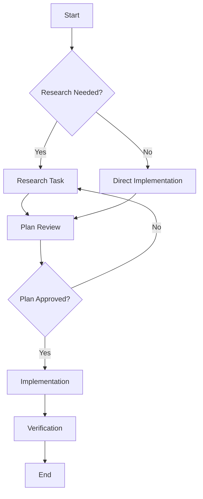

# Feature Research: Agent System Upgrade - Comprehensive Technical Investigation

Complete research documentation for upgrading the multi-agent orchestration system with advanced patterns from industry frameworks and community implementations, plus research/debug agent improvements.

<!-- SPECKIT_TEMPLATE_SOURCE: research | v2.0 -->
<!-- CONSOLIDATED FROM: 003-orchestration-upgrade, 006-research-debug-improvements -->

---

<!-- ANCHOR:metadata -->
## 1. METADATA

- **Research ID**: RESEARCH-001 (Consolidated)
- **Feature/Spec**: Agent System Upgrade (specs/004-agents/003-agent-system-upgrade)
- **Status**: Complete
- **Date Started**: 2026-01-21
- **Date Completed**: 2026-01-23
- **Researcher(s)**: Claude (AI Research Agent)
- **Reviewers**: User
- **Last Updated**: 2026-01-23

**Related Documents**:
- Current Implementation: `.opencode/agent/orchestrate.md`, `.opencode/agent/debug.md`
- Related Specs: Merged from 003-orchestration-upgrade, 006-research-debug-improvements

**Consolidation Note**: This research document contains findings from two research efforts:
1. **Orchestration Patterns (Phase 1)**: Circuit breaker, quality gates, saga, parallel execution
2. **Research/Debug Improvements (Phase 3)**: Agent methodology, template mapping, tool routing

---

<!-- /ANCHOR:metadata -->


<!-- ANCHOR:investigation-report -->
## 2. INVESTIGATION REPORT

### Request Summary

Research orchestration patterns from GitHub repositories (Sheetaa/agents-orchestrator, agnusdei1207/opencode-orchestrator) and major AI agent frameworks (LangGraph, CrewAI, AutoGen, Google ADK) to identify best practices for failure handling, quality gates, parallel execution, context preservation, and task decomposition. The goal is to produce actionable improvements for the current `orchestrate.md` implementation.

### Current Behavior

The current orchestrate.md provides:
- Basic task decomposition with scope/output/success criteria
- Parallel-first principle with dependency awareness
- Retry-Reassign-Escalate failure protocol
- Max 20 agents constraint
- Research-first and spec folder enforcement
- Context preservation via memory saves

Limitations include: no circuit breaker pattern, no structured checkpointing, limited quality gate definitions, no complexity scoring for task decomposition, and no fan-out/fan-in coordination patterns.

### Key Findings

1. **Mermaid Flowcharts and Visual Workflows**: Sheetaa/agents-orchestrator demonstrates that visual workflow definitions (Mermaid diagrams, YAML configs) dramatically improve clarity for complex multi-agent coordination. This enables non-programmatic workflow authoring and easier debugging.

2. **HPFA Architecture**: agnusdei1207/opencode-orchestrator's Hierarchical Parallel Flow Architecture (Commander/Planner/Worker/Reviewer) with 50-agent parallel capability shows that strict role separation and modular prompts enable massive scale while maintaining quality.

3. **State Checkpointing**: LangGraph's interrupt() mechanism and checkpointing system provides model for incremental state preservation that survives failures and enables human-in-the-loop workflows.

4. **Hierarchical Delegation**: CrewAI's Role-Goal-Backstory pattern combined with hierarchical process mode demonstrates effective authority chains for complex task delegation.

5. **Team Presets**: AutoGen's RoundRobinGroupChat, SelectorGroupChat, Swarm, and MagenticOne patterns provide battle-tested templates for different coordination scenarios.

6. **Fan-out/Fan-in**: Google ADK's ParallelAgent and supervisor patterns show how to efficiently coordinate parallel execution with result aggregation.

### Recommendations

**Primary Recommendation**:
Adopt a hybrid architecture combining:
- Visual workflow definitions (Mermaid) for complex task graphs
- HPFA-inspired Commander/Planner/Worker/Reviewer role separation
- LangGraph-style checkpointing for failure recovery
- CrewAI's hierarchical delegation for authority chains
- AutoGen team presets for standard coordination patterns

**Alternative Approaches**:
- Minimal upgrade: Add only circuit breaker and basic checkpointing (lower effort, lower impact)
- Full framework adoption: Replace orchestrate.md with LangGraph or CrewAI integration (high effort, requires infrastructure changes)

---

<!-- /ANCHOR:investigation-report -->


<!-- ANCHOR:executive-overview -->
## 3. EXECUTIVE OVERVIEW

### Executive Summary

This research investigates advanced orchestration patterns for AI agent systems, synthesizing findings from two GitHub repositories and four major frameworks. The current orchestrate.md provides a solid foundation but lacks sophisticated failure handling, structured checkpointing, and advanced coordination patterns that are standard in production-grade orchestration systems.

Key gaps identified include: no circuit breaker pattern for cascading failure prevention, no incremental checkpointing for long-running tasks, limited quality gate definitions beyond basic retry logic, and no formal complexity scoring for task decomposition. The research reveals that industry best practices emphasize visual workflow definitions, strict role separation (Commander/Planner/Worker/Reviewer), and multi-tier memory systems.

The recommended upgrade path prioritizes high-impact, low-friction improvements: adding circuit breaker patterns (P0), implementing structured checkpointing (P0), formalizing quality gates with confidence thresholds (P1), and introducing visual workflow support (P2). This approach preserves the existing architecture while adding critical robustness features.

### Architecture Diagram

```
PROPOSED ORCHESTRATION ARCHITECTURE
===================================

                    ┌─────────────────────────────────────┐
                    │           ORCHESTRATOR              │
                    │   ┌─────────────────────────────┐   │
                    │   │     COMMANDER LAYER         │   │
                    │   │  (Strategy & Decomposition) │   │
                    │   └──────────────┬──────────────┘   │
                    │                  │                  │
                    │   ┌──────────────▼──────────────┐   │
                    │   │      PLANNER LAYER          │   │
                    │   │   (Task Graph & Routing)    │   │
                    │   └──────────────┬──────────────┘   │
                    └──────────────────┼──────────────────┘
                                       │
           ┌───────────────────────────┼───────────────────────────┐
           │                           │                           │
           ▼                           ▼                           ▼
┌─────────────────────┐   ┌─────────────────────┐   ┌─────────────────────┐
│    WORKER POOL      │   │    WORKER POOL      │   │    WORKER POOL      │
│   (@research x3)    │   │   (@general x5)     │   │   (@doc-writer x2)  │
└──────────┬──────────┘   └──────────┬──────────┘   └──────────┬──────────┘
           │                         │                         │
           └───────────────────────────────────────────────────┘
                                       │
                                       ▼
                    ┌─────────────────────────────────────┐
                    │         REVIEWER LAYER              │
                    │   (Quality Gates & Verification)    │
                    └──────────────┬──────────────────────┘
                                   │
                                   ▼
                    ┌─────────────────────────────────────┐
                    │        CHECKPOINT STORE             │
                    │   (State Persistence & Recovery)    │
                    └─────────────────────────────────────┘
```

### Quick Reference Guide

**When to use advanced orchestration patterns**:
- Tasks requiring 5+ parallel agents
- Long-running tasks (>15 minutes)
- Tasks with complex dependency graphs
- High-stakes tasks requiring verification
- Tasks that may need human-in-the-loop intervention

**When NOT to use advanced patterns**:
- Simple sequential tasks
- Single-agent tasks
- Tasks with <3 steps
- Low-stakes exploratory work

**Key considerations**:
- Overhead of checkpointing may not be worth it for simple tasks
- Visual workflows require tooling investment
- Circuit breakers need calibration for specific use cases

### Research Sources

| Source Type | Description | Link/Reference | Credibility |
|-------------|-------------|----------------|-------------|
| GitHub Repository | Sheetaa/agents-orchestrator | https://github.com/Sheetaa/agents-orchestrator | High |
| GitHub Repository | agnusdei1207/opencode-orchestrator | https://github.com/agnusdei1207/opencode-orchestrator | High |
| Documentation | LangGraph Documentation | https://langchain-ai.github.io/langgraph/ | High |
| Documentation | CrewAI Documentation | https://docs.crewai.com/ | High |
| Documentation | AutoGen Documentation | https://microsoft.github.io/autogen/ | High |
| Documentation | Google ADK | https://google.github.io/adk-docs/ | High |
| Article | Circuit Breaker Pattern | Martin Fowler / Microsoft Patterns | High |
| Article | Saga Pattern | Microservices.io | High |

---

<!-- /ANCHOR:executive-overview -->


<!-- ANCHOR:part-1-repository-analysis -->
## PART 1: REPOSITORY ANALYSIS

<!-- /ANCHOR:part-1-repository-analysis -->


<!-- ANCHOR:sheetaaagents-orchestrator-analysis -->
## 4. SHEETAA/AGENTS-ORCHESTRATOR ANALYSIS

### Overview

Sheetaa/agents-orchestrator provides a visual workflow-based approach to multi-agent orchestration with emphasis on declarative configuration and Mermaid flowchart integration.

### Key Patterns

#### 4.1 Mermaid Flowcharts for Workflow Definition

**Concept**: Workflows are defined visually using Mermaid diagrams, which are then parsed into executable task graphs.

**Example Structure**:


**Benefits**:
- Human-readable workflow definitions
- Easy debugging and modification
- Self-documenting orchestration logic
- Non-programmatic workflow authoring

**Applicability to orchestrate.md**:
- Add Mermaid diagram support for complex task graphs
- Use diagrams in spec folders to document orchestration decisions
- Enable visual debugging of task flow

#### 4.2 YAML Configuration System

**Concept**: Workflows and agent configurations are defined in YAML files, separating logic from implementation.

**Example Configuration**:
```yaml
orchestration:
  name: feature-implementation
  max_parallel: 5
  timeout_minutes: 30

  stages:
    - name: research
      agents: [research]
      parallel: true
      max_concurrent: 3

    - name: planning
      agents: [planner]
      depends_on: [research]

    - name: implementation
      agents: [general]
      depends_on: [planning]
      parallel: true
      max_concurrent: 5

    - name: review
      agents: [reviewer]
      depends_on: [implementation]

  failure_handling:
    retry_count: 3
    escalation_threshold: 2
    fallback_agent: senior_agent
```

**Benefits**:
- Declarative configuration
- Easy version control
- Reusable workflow templates
- Clear stage dependencies

#### 4.3 Template Variables System

**Concept**: Dynamic variable substitution in task templates enables reusable patterns.

**Example**:
```yaml
task_template:
  scope: "Implement {{feature_name}} in {{target_file}}"
  success_criteria:
    - "{{feature_name}} is functional"
    - "Tests pass for {{target_file}}"
    - "No lint errors in {{target_file}}"

variables:
  feature_name: "notification-system"
  target_file: "src/notifications.ts"
```

**Benefits**:
- Reduces duplication
- Enables task templates
- Improves consistency

### Integration Recommendations

| Pattern | Priority | Effort | Impact |
|---------|----------|--------|--------|
| Mermaid Flowcharts | P2 | Medium | High |
| YAML Config | P2 | High | Medium |
| Template Variables | P1 | Low | Medium |

---

<!-- /ANCHOR:sheetaaagents-orchestrator-analysis -->


<!-- ANCHOR:agnusdei1207opencode-orchestrator-analysis -->
## 5. AGNUSDEI1207/OPENCODE-ORCHESTRATOR ANALYSIS

### Overview

agnusdei1207/opencode-orchestrator implements a Hierarchical Parallel Flow Architecture (HPFA) designed for massive parallelization (50+ agents) while maintaining quality through strict role separation.

### Key Patterns

#### 5.1 Commander/Planner/Worker/Reviewer Architecture

**Concept**: Four distinct layers with clear responsibilities:

```
┌─────────────────────────────────────────────────────────────┐
│ COMMANDER (Strategic Layer)                                 │
│ - Receives user request                                     │
│ - Determines overall strategy                               │
│ - Sets success criteria                                     │
│ - Makes go/no-go decisions                                  │
└─────────────────────────────────────────────────────────────┘
                              │
                              ▼
┌─────────────────────────────────────────────────────────────┐
│ PLANNER (Tactical Layer)                                    │
│ - Decomposes strategy into tasks                            │
│ - Identifies dependencies                                   │
│ - Determines parallelization opportunities                  │
│ - Creates task graph                                        │
└─────────────────────────────────────────────────────────────┘
                              │
                              ▼
┌─────────────────────────────────────────────────────────────┐
│ WORKERS (Execution Layer)                                   │
│ - Execute individual tasks                                  │
│ - Report progress and blockers                              │
│ - Request resources as needed                               │
│ - Produce artifacts                                         │
└─────────────────────────────────────────────────────────────┘
                              │
                              ▼
┌─────────────────────────────────────────────────────────────┐
│ REVIEWER (Quality Layer)                                    │
│ - Validates worker outputs                                  │
│ - Enforces quality gates                                    │
│ - Requests rework if needed                                 │
│ - Signs off on completion                                   │
└─────────────────────────────────────────────────────────────┘
```

**Benefits**:
- Clear separation of concerns
- Scalable to large agent counts
- Quality enforcement at dedicated layer
- Easy to reason about flow

**Current Gap in orchestrate.md**:
Current implementation conflates Commander and Planner roles. No explicit Reviewer layer exists; quality evaluation is inline.

#### 5.2 50-Agent Parallel Capability

**Concept**: Architecture designed to scale to 50+ parallel workers without degradation.

**Key Enablers**:
```
1. WORKER POOLS
   - Pre-allocated worker capacity by type
   - Dynamic scaling based on task queue
   - Load balancing across workers

2. BATCHING STRATEGY
   - Group similar tasks for efficiency
   - Batch size optimization (3-5 per batch optimal)
   - Staggered dispatch to prevent thundering herd

3. RESOURCE MANAGEMENT
   - Token budget per worker
   - Context window management
   - Rate limiting per agent type
```

**Parallel Dispatch Configuration**:
```yaml
worker_pools:
  research:
    min_workers: 2
    max_workers: 10
    scale_factor: 2  # Double on high load

  implementation:
    min_workers: 3
    max_workers: 20
    scale_factor: 1.5

  documentation:
    min_workers: 1
    max_workers: 5
    scale_factor: 1

dispatch:
  batch_size: 3-5  # Optimal for Claude
  stagger_ms: 100  # Prevent thundering herd
  timeout_per_task: 120000  # 2 minutes
```

**Current Gap**: orchestrate.md has 20-agent limit but no explicit pooling or batching strategy.

#### 5.3 Modular Prompts System

**Concept**: Agent prompts are composed from reusable modules rather than monolithic instructions.

**Structure**:
```
prompts/
├── base/
│   ├── identity.md      # Role definition
│   ├── constraints.md   # Universal rules
│   └── format.md        # Output formatting
├── skills/
│   ├── research.md      # Research capabilities
│   ├── implementation.md # Code writing
│   └── review.md        # Quality assessment
└── context/
    ├── project.md       # Project-specific context
    └── task.md          # Current task context
```

**Composition Example**:
```markdown
# Agent Prompt = base/identity + skills/research + context/task

---
[INCLUDE: base/identity.md]
---
[INCLUDE: skills/research.md]
---
[INCLUDE: context/task.md]
---
```

**Benefits**:
- Reusable prompt components
- Easy A/B testing of prompt variations
- Consistent formatting across agents
- Reduced prompt maintenance burden

#### 5.4 HPFA (Hierarchical Parallel Flow Architecture)

**Concept**: Formal architecture pattern for orchestrating parallel agent execution.

**Core Principles**:
```
1. HIERARCHY
   - Clear authority chain: Commander > Planner > Worker > Reviewer
   - Decisions flow down, results flow up
   - Escalation path defined at each level

2. PARALLELISM
   - Default to parallel execution
   - Only serialize when dependency exists
   - Fan-out/fan-in coordination

3. FLOW CONTROL
   - Checkpoint before each stage
   - Circuit breaker between stages
   - Backpressure when overwhelmed
```

**State Machine**:
```
                    ┌──────────────┐
                    │    IDLE      │
                    └──────┬───────┘
                           │ receive_request
                           ▼
                    ┌──────────────┐
                    │  PLANNING    │
                    └──────┬───────┘
                           │ plan_approved
                           ▼
                    ┌──────────────┐
          ┌────────│  EXECUTING   │────────┐
          │        └──────┬───────┘        │
          │ checkpoint    │ all_complete   │ timeout
          ▼               ▼                ▼
   ┌──────────────┐ ┌──────────────┐ ┌──────────────┐
   │ CHECKPOINTED │ │  REVIEWING   │ │   TIMEOUT    │
   └──────┬───────┘ └──────┬───────┘ └──────┬───────┘
          │ resume         │ approved       │ retry
          │               │               │
          └───────────────┴───────────────┘
                          │
                          ▼
                   ┌──────────────┐
                   │  COMPLETE    │
                   └──────────────┘
```

### Integration Recommendations

| Pattern | Priority | Effort | Impact |
|---------|----------|--------|--------|
| Commander/Planner/Worker/Reviewer | P1 | Medium | High |
| Worker Pools | P2 | High | Medium |
| Modular Prompts | P2 | Medium | Medium |
| HPFA State Machine | P1 | Medium | High |

---

<!-- /ANCHOR:agnusdei1207opencode-orchestrator-analysis -->


<!-- ANCHOR:part-2-framework-analysis -->
## PART 2: FRAMEWORK ANALYSIS

<!-- /ANCHOR:part-2-framework-analysis -->


<!-- ANCHOR:langgraph-analysis -->
## 6. LANGGRAPH ANALYSIS

### Overview

LangGraph (by LangChain) provides graph-based orchestration with first-class support for state management, checkpointing, and human-in-the-loop workflows.

### Key Patterns

#### 6.1 Graph-Based Orchestration

**Concept**: Workflows are defined as directed graphs where nodes are agents/functions and edges are transitions.

**Structure**:
```python
from langgraph.graph import StateGraph, END

# Define state schema
class OrchestratorState(TypedDict):
    task: str
    research_results: list
    implementation: str
    review_status: str

# Build graph
workflow = StateGraph(OrchestratorState)

# Add nodes (agents)
workflow.add_node("research", research_agent)
workflow.add_node("plan", planning_agent)
workflow.add_node("implement", implementation_agent)
workflow.add_node("review", review_agent)

# Add edges (transitions)
workflow.add_edge("research", "plan")
workflow.add_edge("plan", "implement")
workflow.add_edge("implement", "review")

# Add conditional edges
workflow.add_conditional_edges(
    "review",
    review_decision,  # Returns next node based on review
    {
        "approved": END,
        "rejected": "implement",
        "needs_research": "research"
    }
)
```

**Benefits**:
- Explicit workflow visualization
- Type-safe state management
- Conditional routing
- Easy testing of individual nodes

#### 6.2 State Reducers

**Concept**: State updates are handled by reducer functions that merge partial updates into global state.

**Pattern**:
```python
from langgraph.graph import add_messages

class State(TypedDict):
    messages: Annotated[list, add_messages]  # Reducer for message lists
    artifacts: Annotated[dict, merge_dicts]   # Reducer for artifacts
    status: str  # Direct replacement (no reducer)

def merge_dicts(existing: dict, update: dict) -> dict:
    """Custom reducer that deep merges dictionaries"""
    return {**existing, **update}
```

**Benefits**:
- Predictable state updates
- Conflict resolution built-in
- Supports parallel updates
- Enables time-travel debugging

**Applicability to orchestrate.md**:
- Define explicit state schema for orchestration
- Use reducers for merging parallel agent outputs
- Enable conflict resolution for contradictory results

#### 6.3 Checkpointing System

**Concept**: Automatic state persistence at configurable points enables recovery and human-in-the-loop workflows.

**Implementation**:
```python
from langgraph.checkpoint.sqlite import SqliteSaver

# Configure checkpointing
checkpointer = SqliteSaver.from_conn_string("orchestration.db")

# Compile graph with checkpointing
app = workflow.compile(checkpointer=checkpointer)

# Run with thread ID for persistence
config = {"configurable": {"thread_id": "task-123"}}
result = app.invoke(initial_state, config)

# Resume from checkpoint
resume_state = app.get_state(config)
result = app.invoke(None, config)  # Continues from checkpoint
```

**Checkpoint Strategies**:
| Strategy | When | Use Case |
|----------|------|----------|
| Per-Node | After each node completes | Fine-grained recovery |
| Per-Stage | After stage completion | Stage-level recovery |
| On-Demand | Manual trigger | Human review points |
| Periodic | Time-based interval | Long-running tasks |

#### 6.4 interrupt() Mechanism

**Concept**: Allows workflow to pause and wait for external input (human approval, data, etc.).

**Pattern**:
```python
from langgraph.prebuilt import interrupt

def review_node(state):
    """Node that requires human approval"""
    review_result = llm.invoke(state["implementation"])

    if review_result.confidence < 0.8:
        # Pause for human review
        human_input = interrupt(
            "Review needed",
            {
                "implementation": state["implementation"],
                "confidence": review_result.confidence,
                "concerns": review_result.concerns
            }
        )
        return {"review_status": human_input["decision"]}

    return {"review_status": "auto_approved"}
```

**Benefits**:
- Human-in-the-loop without breaking workflow
- State preserved during interruption
- Timeout handling built-in
- Audit trail of human decisions

### Integration Recommendations

| Pattern | Priority | Effort | Impact |
|---------|----------|--------|--------|
| Graph-Based Orchestration | P2 | High | High |
| State Reducers | P1 | Medium | High |
| Checkpointing | P0 | Medium | Critical |
| interrupt() Mechanism | P1 | Medium | High |

---

<!-- /ANCHOR:langgraph-analysis -->


<!-- ANCHOR:crewai-analysis -->
## 7. CREWAI ANALYSIS

### Overview

CrewAI provides role-based agent orchestration with focus on agent personas, hierarchical delegation, and built-in memory systems.

### Key Patterns

#### 7.1 Role-Goal-Backstory Pattern

**Concept**: Agents are defined with explicit roles, goals, and backstories that inform their behavior and decision-making.

**Structure**:
```python
from crewai import Agent

research_agent = Agent(
    role="Senior Research Analyst",
    goal="Discover comprehensive, accurate information about the task domain",
    backstory="""You are a meticulous researcher with 10 years of experience
    in technical investigation. You never make claims without evidence and
    always cite your sources. You're known for finding information that
    others miss.""",
    verbose=True,
    allow_delegation=True,
    tools=[search_tool, read_tool]
)

implementation_agent = Agent(
    role="Principal Software Engineer",
    goal="Write clean, maintainable, well-tested code",
    backstory="""You are a seasoned engineer who has worked on large-scale
    systems. You prioritize readability over cleverness, always write tests,
    and follow established patterns. You refuse to ship code you're not
    confident in.""",
    verbose=True,
    allow_delegation=False,
    tools=[edit_tool, bash_tool]
)
```

**Benefits**:
- Consistent agent behavior
- Implicit decision-making guidelines
- Personality-driven interactions
- Clear authority levels

**Applicability to orchestrate.md**:
- Enhance agent definitions with backstories
- Use goals to guide task completion criteria
- Role definitions inform capability boundaries

#### 7.2 Hierarchical Delegation Process

**Concept**: Manager agents can delegate to worker agents with full context and authority chains.

**Process Modes**:
```python
from crewai import Crew, Process

# Sequential: Agents work in order
sequential_crew = Crew(
    agents=[research, plan, implement, review],
    tasks=[research_task, plan_task, impl_task, review_task],
    process=Process.sequential
)

# Hierarchical: Manager delegates to workers
hierarchical_crew = Crew(
    agents=[research, implement, review],
    tasks=[complex_task],
    process=Process.hierarchical,
    manager_llm=manager_model,  # Manager makes delegation decisions
    manager_agent=orchestrator_agent  # Or use predefined manager
)
```

**Hierarchical Flow**:
```
┌─────────────────────────────────────────┐
│           MANAGER AGENT                 │
│  - Analyzes task complexity             │
│  - Selects appropriate worker(s)        │
│  - Provides context and constraints     │
│  - Evaluates results                    │
│  - Decides: accept/reject/reassign      │
└────────────────┬────────────────────────┘
                 │ delegate
                 ▼
    ┌────────────┴────────────┐
    │                         │
    ▼                         ▼
┌────────────┐         ┌────────────┐
│  WORKER A  │         │  WORKER B  │
│  @research │         │  @general  │
└────────────┘         └────────────┘
    │                         │
    └──────────┬──────────────┘
               │ results
               ▼
┌─────────────────────────────────────────┐
│           MANAGER AGENT                 │
│  - Synthesizes worker outputs           │
│  - Resolves conflicts                   │
│  - Produces unified deliverable         │
└─────────────────────────────────────────┘
```

#### 7.3 Multi-Tier Memory System

**Concept**: Three-tier memory architecture enables context preservation across different scopes.

**Memory Tiers**:
```
┌─────────────────────────────────────────────────────────────────┐
│ TIER 1: SHORT-TERM MEMORY (Task Context)                        │
│ - Current task state                                            │
│ - Recent agent interactions                                     │
│ - Active artifacts                                              │
│ - Scope: Single task execution                                  │
│ - Persistence: In-memory only                                   │
└─────────────────────────────────────────────────────────────────┘
                              │
                              ▼
┌─────────────────────────────────────────────────────────────────┐
│ TIER 2: LONG-TERM MEMORY (Session Context)                      │
│ - Session history                                               │
│ - Completed task summaries                                      │
│ - Learned patterns                                              │
│ - Scope: Full orchestration session                             │
│ - Persistence: Session store (SQLite/Redis)                     │
└─────────────────────────────────────────────────────────────────┘
                              │
                              ▼
┌─────────────────────────────────────────────────────────────────┐
│ TIER 3: ENTITY MEMORY (Cross-Session)                           │
│ - User preferences                                              │
│ - Project patterns                                              │
│ - Historical decisions                                          │
│ - Scope: Persistent across sessions                             │
│ - Persistence: Vector store (Spec Kit Memory)                   │
└─────────────────────────────────────────────────────────────────┘
```

**CrewAI Memory Configuration**:
```python
from crewai import Crew
from crewai.memory import ShortTermMemory, LongTermMemory, EntityMemory

crew = Crew(
    agents=[...],
    tasks=[...],
    memory=True,  # Enable memory
    short_term_memory=ShortTermMemory(),
    long_term_memory=LongTermMemory(
        storage=SQLiteStorage("orchestration_memory.db")
    ),
    entity_memory=EntityMemory(
        storage=VectorStorage("entities.index")
    )
)
```

**Applicability to orchestrate.md**:
- Current memory system maps to Tier 3 (Entity Memory via Spec Kit)
- Add Tier 1 (Short-Term) for task context
- Add Tier 2 (Long-Term) for session continuity

### Integration Recommendations

| Pattern | Priority | Effort | Impact |
|---------|----------|--------|--------|
| Role-Goal-Backstory | P2 | Low | Medium |
| Hierarchical Delegation | P1 | Medium | High |
| Multi-Tier Memory | P1 | High | High |

---

<!-- /ANCHOR:crewai-analysis -->


<!-- ANCHOR:autogen-analysis -->
## 8. AUTOGEN ANALYSIS

### Overview

AutoGen (by Microsoft) provides team-based agent orchestration with predefined team patterns and flexible conversation management.

### Key Patterns

#### 8.1 Team Presets

**Concept**: Pre-configured team patterns for common orchestration scenarios.

**RoundRobinGroupChat**:
```python
from autogen import RoundRobinGroupChat

# Agents take turns in fixed order
team = RoundRobinGroupChat(
    agents=[research, plan, implement, review],
    max_rounds=10
)
```
- Use case: Sequential workflows with predictable agent order
- Benefit: Simple, deterministic execution

**SelectorGroupChat**:
```python
from autogen import SelectorGroupChat

# Central selector chooses next agent
team = SelectorGroupChat(
    agents=[research, implement, review],
    selector_func=select_next_agent,  # Custom selection logic
    max_rounds=20
)

def select_next_agent(messages, agents):
    """Select next agent based on conversation state"""
    last_message = messages[-1]
    if "research needed" in last_message.content.lower():
        return research
    elif "implement" in last_message.content.lower():
        return implement
    return review
```
- Use case: Dynamic workflows requiring intelligent routing
- Benefit: Flexible, context-aware agent selection

**Swarm**:
```python
from autogen import Swarm

# Agents self-organize based on capabilities
team = Swarm(
    agents=[agent1, agent2, agent3],
    task_queue=task_queue,
    max_concurrent=5
)
```
- Use case: Parallel execution with self-organization
- Benefit: High throughput, emergent coordination

**MagenticOne**:
```python
from autogen import MagenticOne

# Specialized multi-agent team for complex tasks
team = MagenticOne(
    orchestrator=orchestrator_agent,
    web_surfer=web_agent,
    file_surfer=file_agent,
    coder=code_agent,
    computer_user=terminal_agent
)
```
- Use case: Complex tasks requiring diverse capabilities
- Benefit: Specialized agents working in concert

#### 8.2 Termination Conditions

**Concept**: Explicit conditions for ending agent conversations and task completion.

**Termination Types**:
```python
from autogen import (
    MaxMessageTermination,
    TextMentionTermination,
    TokenLimitTermination,
    TimeoutTermination,
    FunctionCallTermination
)

# Combine termination conditions
termination = (
    MaxMessageTermination(max_messages=50) |  # OR
    TextMentionTermination(text="TASK_COMPLETE") |
    TokenLimitTermination(max_tokens=100000) |
    TimeoutTermination(timeout_seconds=600)
)

team = GroupChat(
    agents=[...],
    termination_condition=termination
)
```

**Termination Matrix**:
| Condition | Trigger | Use Case |
|-----------|---------|----------|
| MaxMessage | Message count reached | Prevent infinite loops |
| TextMention | Specific phrase detected | Explicit completion signal |
| TokenLimit | Token budget exhausted | Cost control |
| Timeout | Time limit exceeded | SLA enforcement |
| FunctionCall | Specific function called | Programmatic completion |
| Custom | User-defined logic | Domain-specific rules |

#### 8.3 Nested Chats

**Concept**: Conversations can spawn sub-conversations for complex sub-tasks.

**Pattern**:
```python
def handle_complex_subtask(parent_context):
    """Spawn nested conversation for subtask"""
    nested_team = GroupChat(
        agents=[specialist1, specialist2],
        max_rounds=5,
        context=parent_context  # Inherit context
    )

    result = nested_team.run(subtask)
    return result.summary

# Register nested handler
main_agent.register_nested_chat(
    trigger=lambda msg: "complex_analysis" in msg.content,
    handler=handle_complex_subtask
)
```

**Benefits**:
- Encapsulated sub-workflows
- Context inheritance
- Result aggregation
- Reduced complexity in main flow

### Integration Recommendations

| Pattern | Priority | Effort | Impact |
|---------|----------|--------|--------|
| Team Presets (Selector) | P1 | Medium | High |
| Termination Conditions | P0 | Low | High |
| Nested Chats | P2 | Medium | Medium |

---

<!-- /ANCHOR:autogen-analysis -->


<!-- ANCHOR:google-adk-analysis -->
## 9. GOOGLE ADK ANALYSIS

### Overview

Google's Agent Development Kit provides enterprise-grade orchestration patterns with focus on scalability and reliability.

### Key Patterns

#### 9.1 Fan-out/Fan-in Pattern

**Concept**: Distribute work across multiple agents (fan-out), then aggregate results (fan-in).

**Structure**:
```
                    ┌─────────────┐
                    │  DISPATCH   │
                    │   (fan-out) │
                    └──────┬──────┘
                           │
           ┌───────────────┼───────────────┐
           │               │               │
           ▼               ▼               ▼
    ┌────────────┐  ┌────────────┐  ┌────────────┐
    │  WORKER 1  │  │  WORKER 2  │  │  WORKER 3  │
    │  (task A)  │  │  (task B)  │  │  (task C)  │
    └─────┬──────┘  └─────┬──────┘  └─────┬──────┘
          │               │               │
          └───────────────┼───────────────┘
                          │
                    ┌─────▼─────┐
                    │ AGGREGATE │
                    │  (fan-in) │
                    └───────────┘
```

**Implementation**:
```python
from google.adk import ParallelAgent, AggregatorAgent

# Fan-out: Dispatch to parallel workers
parallel = ParallelAgent(
    workers=[
        Worker(task="research_api"),
        Worker(task="research_patterns"),
        Worker(task="research_security")
    ],
    timeout_per_worker=60,
    fail_strategy="partial"  # Continue with successful results
)

# Fan-in: Aggregate results
aggregator = AggregatorAgent(
    strategy="merge",  # merge | vote | best
    conflict_resolution="latest_wins"
)

# Compose
workflow = parallel >> aggregator
```

**Fail Strategies**:
| Strategy | Behavior | Use Case |
|----------|----------|----------|
| `fail_fast` | Abort all on first failure | Critical tasks |
| `partial` | Continue with successful results | Resilient collection |
| `retry_failed` | Retry failed workers | Important but flaky tasks |
| `ignore` | Proceed regardless | Best-effort collection |

#### 9.2 ParallelAgent Pattern

**Concept**: Dedicated agent type for managing parallel execution with built-in coordination.

**Configuration**:
```python
from google.adk import ParallelAgent

parallel = ParallelAgent(
    name="research_coordinator",

    # Worker configuration
    workers=[research1, research2, research3],
    max_concurrent=3,

    # Coordination
    barrier_sync=True,  # Wait for all before proceeding
    result_order="completion",  # completion | submission

    # Resilience
    timeout_seconds=120,
    retry_config={
        "max_retries": 2,
        "backoff_factor": 2,
        "retry_on": ["timeout", "rate_limit"]
    },

    # Resource management
    token_budget_per_worker=10000,
    rate_limit_rpm=60
)
```

#### 9.3 Supervisor Patterns

**Concept**: Supervisor agents monitor and manage worker agents with defined intervention strategies.

**Supervision Strategies**:
```python
from google.adk import Supervisor, SupervisionStrategy

# One-for-One: Restart only failed worker
one_for_one = SupervisionStrategy.ONE_FOR_ONE

# One-for-All: Restart all workers on any failure
one_for_all = SupervisionStrategy.ONE_FOR_ALL

# Rest-for-One: Restart failed worker and all started after it
rest_for_one = SupervisionStrategy.REST_FOR_ONE

supervisor = Supervisor(
    workers=[worker1, worker2, worker3],
    strategy=one_for_one,
    max_restarts=3,
    restart_window_seconds=60
)
```

**Supervision Tree**:
```
                    ┌─────────────────┐
                    │  ROOT SUPERVISOR │
                    │  (one-for-all)   │
                    └────────┬────────┘
                             │
           ┌─────────────────┼─────────────────┐
           │                 │                 │
           ▼                 ▼                 ▼
┌──────────────────┐ ┌──────────────────┐ ┌──────────────────┐
│ RESEARCH SUPER   │ │ IMPLEMENT SUPER  │ │ REVIEW SUPER     │
│ (one-for-one)    │ │ (rest-for-one)   │ │ (one-for-one)    │
└────────┬─────────┘ └────────┬─────────┘ └────────┬─────────┘
         │                    │                    │
    ┌────┼────┐          ┌────┼────┐          ┌────┴────┐
    ▼    ▼    ▼          ▼    ▼    ▼          ▼         ▼
   W1   W2   W3         W4   W5   W6         W7        W8
```

### Integration Recommendations

| Pattern | Priority | Effort | Impact |
|---------|----------|--------|--------|
| Fan-out/Fan-in | P1 | Medium | High |
| ParallelAgent | P1 | Medium | High |
| Supervisor Patterns | P2 | High | Medium |

---

<!-- /ANCHOR:google-adk-analysis -->


<!-- ANCHOR:part-3-best-practices-analysis -->
## PART 3: BEST PRACTICES ANALYSIS

<!-- /ANCHOR:part-3-best-practices-analysis -->


<!-- ANCHOR:failure-handling-patterns -->
## 10. FAILURE HANDLING PATTERNS

### 10.1 Circuit Breaker Pattern

**Concept**: Prevent cascading failures by detecting failure patterns and temporarily blocking requests to failing services.

**State Machine**:
```
                    ┌──────────────┐
         ┌─────────│    CLOSED    │◄─────────┐
         │         │ (Normal Op)  │          │
         │         └──────┬───────┘          │
         │                │ failure_threshold│
         │                │ exceeded         │
         │                ▼                  │
         │         ┌──────────────┐          │
         │         │     OPEN     │          │
         │         │ (Fail Fast)  │          │
         │         └──────┬───────┘          │
         │                │ timeout          │
         │                │ expired          │
         │                ▼                  │
         │         ┌──────────────┐          │
success  │         │  HALF-OPEN   │──────────┘
         │         │ (Testing)    │  success
         └─────────└──────┬───────┘
                          │ failure
                          ▼
                   ┌──────────────┐
                   │     OPEN     │
                   │ (Reset)      │
                   └──────────────┘
```

**Implementation**:
```javascript
class CircuitBreaker {
    constructor(options = {}) {
        this.failureThreshold = options.failureThreshold || 5;
        this.recoveryTimeout = options.recoveryTimeout || 30000;
        this.halfOpenRequests = options.halfOpenRequests || 3;

        this.state = 'CLOSED';
        this.failures = 0;
        this.successes = 0;
        this.lastFailureTime = null;
    }

    async execute(fn) {
        if (this.state === 'OPEN') {
            if (Date.now() - this.lastFailureTime > this.recoveryTimeout) {
                this.state = 'HALF_OPEN';
                this.successes = 0;
            } else {
                throw new CircuitOpenError('Circuit breaker is OPEN');
            }
        }

        try {
            const result = await fn();
            this.onSuccess();
            return result;
        } catch (error) {
            this.onFailure();
            throw error;
        }
    }

    onSuccess() {
        this.failures = 0;
        if (this.state === 'HALF_OPEN') {
            this.successes++;
            if (this.successes >= this.halfOpenRequests) {
                this.state = 'CLOSED';
            }
        }
    }

    onFailure() {
        this.failures++;
        this.lastFailureTime = Date.now();

        if (this.failures >= this.failureThreshold) {
            this.state = 'OPEN';
        }
    }
}
```

**Applicability to orchestrate.md**:
- Wrap sub-agent dispatch in circuit breaker
- Track failures per agent type
- Prevent cascading failures when sub-agent is unhealthy

### 10.2 Exponential Backoff

**Concept**: Progressively increase delay between retries to prevent overwhelming failing services.

**Formula**: `delay = min(base * (2 ^ attempt) + jitter, maxDelay)`

**Implementation**:
```javascript
async function withExponentialBackoff(fn, options = {}) {
    const {
        maxRetries = 3,
        baseDelay = 1000,
        maxDelay = 30000,
        jitterFactor = 0.1
    } = options;

    for (let attempt = 0; attempt <= maxRetries; attempt++) {
        try {
            return await fn();
        } catch (error) {
            if (attempt === maxRetries) throw error;

            const exponentialDelay = baseDelay * Math.pow(2, attempt);
            const jitter = exponentialDelay * jitterFactor * Math.random();
            const delay = Math.min(exponentialDelay + jitter, maxDelay);

            await sleep(delay);
        }
    }
}
```

**Retry Configuration Matrix**:
| Error Type | Retryable | Max Retries | Base Delay | Notes |
|------------|-----------|-------------|------------|-------|
| Timeout | Yes | 3 | 1000ms | Likely transient |
| Rate Limit | Yes | 5 | 5000ms | Respect limit |
| Auth Error | No | 0 | - | Will fail again |
| Validation | No | 0 | - | Input error |
| Server Error | Yes | 3 | 2000ms | May be transient |

### 10.3 Saga Pattern

**Concept**: Long-running transactions with compensating actions for rollback on failure.

**Structure**:
```
┌─────────────────────────────────────────────────────────────────┐
│                        SAGA COORDINATOR                          │
└─────────────────────────────────────────────────────────────────┘
                              │
     FORWARD PATH (Success)   │   COMPENSATING PATH (Failure)
                              │
         Step 1: Research     │◄── Compensate 1: Archive research
              ↓               │
         Step 2: Plan         │◄── Compensate 2: Delete plan
              ↓               │
         Step 3: Implement    │◄── Compensate 3: Revert changes
              ↓               │
         Step 4: Review       │◄── Compensate 4: Reset review state
              ↓               │
         Step 5: Deploy       │◄── Compensate 5: Rollback deploy
              ↓               │
           SUCCESS            │          FAILURE + ROLLBACK
```

**Implementation**:
```javascript
class SagaCoordinator {
    constructor() {
        this.steps = [];
        this.completedSteps = [];
    }

    addStep(name, execute, compensate) {
        this.steps.push({ name, execute, compensate });
    }

    async run(context) {
        for (const step of this.steps) {
            try {
                const result = await step.execute(context);
                this.completedSteps.push({ step, result });
                context = { ...context, [step.name]: result };
            } catch (error) {
                await this.compensate(error);
                throw new SagaFailedError(step.name, error);
            }
        }
        return context;
    }

    async compensate(originalError) {
        // Compensate in reverse order
        for (const { step, result } of this.completedSteps.reverse()) {
            try {
                await step.compensate(result);
            } catch (compensateError) {
                console.error(`Compensation failed for ${step.name}`, compensateError);
                // Continue compensating other steps
            }
        }
    }
}

// Usage
const saga = new SagaCoordinator();
saga.addStep('research', doResearch, archiveResearch);
saga.addStep('plan', createPlan, deletePlan);
saga.addStep('implement', implement, revertChanges);
```

**Applicability to orchestrate.md**:
- Use for multi-file modifications
- Define compensating actions for each stage
- Enable clean rollback on partial failure

---

<!-- /ANCHOR:failure-handling-patterns -->


<!-- ANCHOR:quality-gates -->
## 11. QUALITY GATES

### 11.1 Multi-Stage Verification

**Concept**: Progressive quality checks at each stage of task completion.

**Stage Gates**:
```
┌─────────────────────────────────────────────────────────────────┐
│ GATE 1: PRE-EXECUTION                                           │
│ □ Task requirements understood?                                 │
│ □ Dependencies satisfied?                                       │
│ □ Resources available?                                          │
│ □ No blocking issues?                                           │
└─────────────────────────────────────────────────────────────────┘
                              │ PASS
                              ▼
┌─────────────────────────────────────────────────────────────────┐
│ GATE 2: EXECUTION MONITORING                                    │
│ □ Progress within expected bounds?                              │
│ □ No error accumulation?                                        │
│ □ Token budget on track?                                        │
│ □ Intermediate outputs valid?                                   │
└─────────────────────────────────────────────────────────────────┘
                              │ PASS
                              ▼
┌─────────────────────────────────────────────────────────────────┐
│ GATE 3: OUTPUT VALIDATION                                       │
│ □ Deliverables complete?                                        │
│ □ Success criteria met?                                         │
│ □ No regressions introduced?                                    │
│ □ Tests passing?                                                │
└─────────────────────────────────────────────────────────────────┘
                              │ PASS
                              ▼
┌─────────────────────────────────────────────────────────────────┐
│ GATE 4: INTEGRATION CHECK                                       │
│ □ Works with existing system?                                   │
│ □ No conflicts with parallel work?                              │
│ □ Documentation updated?                                        │
│ □ Ready for synthesis?                                          │
└─────────────────────────────────────────────────────────────────┘
```

### 11.2 Confidence Thresholds

**Concept**: Quantified confidence levels trigger different handling paths.

**Threshold Matrix**:
| Confidence | Label | Action | Escalation |
|------------|-------|--------|------------|
| 95-100% | Very High | Auto-approve | None |
| 80-94% | High | Proceed with logging | Log for audit |
| 60-79% | Medium | Soft verification | Additional check |
| 40-59% | Low | Hard verification | Human review |
| 0-39% | Very Low | Block | Mandatory human approval |

**Implementation**:
```javascript
function handleByConfidence(result) {
    const confidence = result.confidence;

    if (confidence >= 0.95) {
        return { action: 'AUTO_APPROVE', escalation: null };
    } else if (confidence >= 0.80) {
        return { action: 'PROCEED', escalation: 'LOG' };
    } else if (confidence >= 0.60) {
        return { action: 'SOFT_VERIFY', escalation: 'ADDITIONAL_CHECK' };
    } else if (confidence >= 0.40) {
        return { action: 'HARD_VERIFY', escalation: 'HUMAN_REVIEW' };
    } else {
        return { action: 'BLOCK', escalation: 'MANDATORY_APPROVAL' };
    }
}
```

### 11.3 Quality Scoring

**Concept**: Weighted scoring system for evaluating agent outputs.

**Scoring Dimensions**:
```
┌─────────────────────────────────────────────────────────────────┐
│ QUALITY SCORE = Σ(weight × dimension_score) / Σ(weights)        │
├─────────────────────────────────────────────────────────────────┤
│                                                                 │
│ Dimension          Weight    Score (0-100)    Weighted          │
│ ─────────────────────────────────────────────────────────────   │
│ Completeness       0.30      [__]            [__]               │
│ Accuracy           0.25      [__]            [__]               │
│ Consistency        0.20      [__]            [__]               │
│ Performance        0.15      [__]            [__]               │
│ Documentation      0.10      [__]            [__]               │
│ ─────────────────────────────────────────────────────────────   │
│ TOTAL              1.00                      [__]/100           │
│                                                                 │
│ Threshold: 80+ = Accept, 60-79 = Review, <60 = Reject           │
└─────────────────────────────────────────────────────────────────┘
```

---

<!-- /ANCHOR:quality-gates -->


<!-- ANCHOR:parallel-execution -->
## 12. PARALLEL EXECUTION

### 12.1 Optimal Parallel Counts

**Research Finding**: Empirical testing across frameworks shows optimal parallel agent counts.

**Optimal Ranges**:
| Task Type | Min Parallel | Optimal | Max Parallel | Rationale |
|-----------|--------------|---------|--------------|-----------|
| Research | 2 | 3 | 5 | Diminishing returns, context overlap |
| Implementation | 3 | 5 | 8 | File conflicts at higher counts |
| Documentation | 2 | 3 | 5 | Style consistency concerns |
| Review | 2 | 2 | 3 | Need consensus, not volume |

**Batch Size Recommendations**:
```
BATCH SIZE DECISION TREE
========================

Task complexity?
├── Simple (< 5 min each) → Batch of 5
├── Medium (5-15 min each) → Batch of 3
└── Complex (> 15 min each) → Batch of 2 or sequential

Resource constraints?
├── High memory → Reduce batch by 1
├── Rate limited → Stagger dispatch by 500ms
└── Token budget tight → Reduce batch by 2

Dependency density?
├── Independent tasks → Max batch size
├── Some dependencies → Dependency-aware batching
└── Sequential chain → No batching
```

### 12.2 Dependency-Aware Scheduling

**Concept**: Schedule tasks based on dependency graph to maximize parallelism while respecting constraints.

**Algorithm**:
```python
def schedule_tasks(tasks, dependencies):
    """
    Topological sort with parallel level assignment
    """
    # Build dependency graph
    graph = build_dependency_graph(tasks, dependencies)

    # Calculate levels (distance from root)
    levels = {}
    for task in topological_sort(graph):
        deps = graph.predecessors(task)
        if not deps:
            levels[task] = 0
        else:
            levels[task] = max(levels[d] for d in deps) + 1

    # Group by level for parallel execution
    schedule = defaultdict(list)
    for task, level in levels.items():
        schedule[level].append(task)

    return schedule

# Result:
# Level 0: [task_a, task_b]  ← Parallel
# Level 1: [task_c]          ← After 0 completes
# Level 2: [task_d, task_e]  ← Parallel after 1
```

**Visual Example**:
```
DEPENDENCY GRAPH              SCHEDULED EXECUTION
================              ===================

    A ─────┐                  Level 0: [A, B] (parallel)
           │                       │
    B ─────┼───► C                 ▼
           │                  Level 1: [C] (sequential)
    D ─────┼───► E                 │
           │                       ▼
    F ─────┘                  Level 2: [D, E, F] (parallel)
```

### 12.3 Work Stealing

**Concept**: Idle workers can "steal" tasks from busy workers' queues.

**Benefits**:
- Better load balancing
- Reduced idle time
- Adaptive to varying task durations

**Implementation Sketch**:
```javascript
class WorkStealingScheduler {
    constructor(workerCount) {
        this.queues = Array(workerCount).fill(null).map(() => []);
        this.workers = [];
    }

    addTask(task) {
        // Add to shortest queue
        const shortestQueue = this.queues.reduce((min, q, i) =>
            q.length < this.queues[min].length ? i : min, 0);
        this.queues[shortestQueue].push(task);
    }

    getTask(workerIndex) {
        // Try own queue first
        if (this.queues[workerIndex].length > 0) {
            return this.queues[workerIndex].shift();
        }

        // Steal from longest queue
        const longestQueue = this.queues.reduce((max, q, i) =>
            q.length > this.queues[max].length ? i : max, 0);

        if (this.queues[longestQueue].length > 1) {
            return this.queues[longestQueue].pop(); // Steal from end
        }

        return null; // No work available
    }
}
```

---

<!-- /ANCHOR:parallel-execution -->


<!-- ANCHOR:context-preservation -->
## 13. CONTEXT PRESERVATION

### 13.1 Incremental Checkpoints

**Concept**: Save state incrementally to minimize data loss and enable fine-grained recovery.

**Checkpoint Strategy**:
```
┌─────────────────────────────────────────────────────────────────┐
│ CHECKPOINT LEVELS                                               │
├─────────────────────────────────────────────────────────────────┤
│                                                                 │
│ L1: MICRO-CHECKPOINT (Per Operation)                            │
│     - File edits                                                │
│     - API calls                                                 │
│     - Tool invocations                                          │
│     Frequency: Every 10-30 seconds                              │
│                                                                 │
│ L2: TASK-CHECKPOINT (Per Task Completion)                       │
│     - Task results                                              │
│     - Intermediate artifacts                                    │
│     - Agent state snapshots                                     │
│     Frequency: On task boundary                                 │
│                                                                 │
│ L3: STAGE-CHECKPOINT (Per Stage Completion)                     │
│     - Full orchestration state                                  │
│     - Aggregated results                                        │
│     - Decision history                                          │
│     Frequency: On stage boundary                                │
│                                                                 │
│ L4: SESSION-CHECKPOINT (Per Session/Milestone)                  │
│     - Complete context dump                                     │
│     - Memory save                                               │
│     - Handover document                                         │
│     Frequency: On demand / session end                          │
│                                                                 │
└─────────────────────────────────────────────────────────────────┘
```

**Checkpoint Data Structure**:
```javascript
const checkpoint = {
    // Metadata
    id: "ckpt-20260121-143052-abc123",
    timestamp: "2026-01-21T14:30:52Z",
    level: "L2",  // MICRO | TASK | STAGE | SESSION

    // State
    orchestrationState: {
        currentStage: "implementation",
        completedTasks: ["research", "planning"],
        activeWorkers: 3,
        pendingTasks: 5
    },

    // Results
    taskResults: {
        "research": { status: "complete", artifacts: [...] },
        "planning": { status: "complete", plan: {...} }
    },

    // Context
    context: {
        specFolder: "specs/003-orchestration-upgrade",
        originalRequest: "...",
        decisions: [...]
    },

    // Recovery
    recovery: {
        nextTask: "implement-module-a",
        resumePoint: "line-42",
        requiredContext: [...]
    }
};
```

### 13.2 Two-Zone Architecture

**Concept**: Separate hot (active) and cold (archived) storage for efficient context management.

**Architecture**:
```
┌─────────────────────────────────────────────────────────────────┐
│                     TWO-ZONE ARCHITECTURE                       │
├─────────────────────────────────────────────────────────────────┤
│                                                                 │
│ ┌─────────────────────────────────────────────────────────────┐ │
│ │                     HOT ZONE                                │ │
│ │                  (Active Memory)                            │ │
│ │                                                             │ │
│ │  • Current task context                                     │ │
│ │  • Recent checkpoints (last 5)                              │ │
│ │  • Active agent states                                      │ │
│ │  • Pending work queue                                       │ │
│ │                                                             │ │
│ │  Storage: In-memory / Redis                                 │ │
│ │  Access: < 10ms                                             │ │
│ │  Retention: Session duration                                │ │
│ └─────────────────────────────────────────────────────────────┘ │
│                              │                                  │
│                    PROMOTION │ DEMOTION                         │
│                              │                                  │
│ ┌─────────────────────────────────────────────────────────────┐ │
│ │                     COLD ZONE                               │ │
│ │                  (Archive Memory)                           │ │
│ │                                                             │ │
│ │  • Completed task results                                   │ │
│ │  • Historical checkpoints                                   │ │
│ │  • Session summaries                                        │ │
│ │  • Decision records                                         │ │
│ │                                                             │ │
│ │  Storage: SQLite / Spec Kit Memory                          │ │
│ │  Access: < 100ms                                            │ │
│ │  Retention: Permanent                                       │ │
│ └─────────────────────────────────────────────────────────────┘ │
│                                                                 │
└─────────────────────────────────────────────────────────────────┘
```

**Promotion/Demotion Rules**:
| Trigger | Direction | Data |
|---------|-----------|------|
| Task starts | Cold → Hot | Task context, related decisions |
| Task completes | Hot → Cold | Results, artifacts |
| Checkpoint | Hot → Cold | State snapshot |
| Resume | Cold → Hot | Last checkpoint, pending tasks |
| Session end | Hot → Cold | All active state |

### 13.3 Context Compression

**Concept**: Compress context to fit within token limits while preserving essential information.

**Compression Strategies**:
```
STRATEGY 1: SUMMARY REPLACEMENT
===============================
Before: Full conversation history (50,000 tokens)
After:  Summary of key decisions + recent messages (5,000 tokens)

STRATEGY 2: ARTIFACT EXTERNALIZATION
====================================
Before: Full code files inline (20,000 tokens)
After:  File references + key excerpts (2,000 tokens)

STRATEGY 3: HIERARCHICAL SUMMARIZATION
======================================
Before: Detailed task results (10,000 tokens)
After:  Task summaries with links to full results (1,000 tokens)

STRATEGY 4: RELEVANCE FILTERING
===============================
Before: All context (30,000 tokens)
After:  Context relevant to current task (5,000 tokens)
```

---

<!-- /ANCHOR:context-preservation -->


<!-- ANCHOR:task-decomposition -->
## 14. TASK DECOMPOSITION

### 14.1 Atomic Tasks

**Concept**: Break tasks into smallest independently completable units.

**Atomicity Criteria**:
```
An ATOMIC TASK must satisfy:
============================

□ SINGLE RESPONSIBILITY
  - One clear objective
  - One expected output
  - One success criterion

□ INDEPENDENT COMPLETION
  - Can be marked "done" without other tasks
  - No partial completion states
  - Clear boundary

□ BOUNDED SCOPE
  - Estimable effort (< 30 minutes typical)
  - Limited file changes (< 5 files)
  - Predictable complexity

□ TESTABLE OUTCOME
  - Verifiable completion
  - Observable artifact
  - Measurable success
```

**Non-Atomic → Atomic Decomposition**:
```
NON-ATOMIC (BAD):
"Implement authentication system"

ATOMIC BREAKDOWN (GOOD):
├── T1: Create user schema in database
├── T2: Implement password hashing utility
├── T3: Create login API endpoint
├── T4: Create registration API endpoint
├── T5: Implement JWT token generation
├── T6: Create auth middleware
├── T7: Write unit tests for auth utilities
├── T8: Write integration tests for auth flow
└── T9: Update API documentation
```

### 14.2 Complexity Scoring

**Concept**: Quantify task complexity to guide decomposition and resource allocation.

**5-Dimension Scoring**:
```
┌─────────────────────────────────────────────────────────────────┐
│ COMPLEXITY SCORE CALCULATOR                                     │
├─────────────────────────────────────────────────────────────────┤
│                                                                 │
│ DIMENSION 1: SCOPE (Weight: 0.25)                               │
│ ───────────────────────────────                                 │
│ 1: Single file, < 50 LOC                                        │
│ 2: Single component, 50-200 LOC                                 │
│ 3: Multiple components, 200-500 LOC                             │
│ 4: System feature, 500-1000 LOC                                 │
│ 5: Architectural change, > 1000 LOC                             │
│                                                                 │
│ DIMENSION 2: DEPENDENCIES (Weight: 0.20)                        │
│ ───────────────────────────────────────                         │
│ 1: No dependencies                                              │
│ 2: 1-2 internal dependencies                                    │
│ 3: 3-5 dependencies                                             │
│ 4: External API/service integration                             │
│ 5: Multiple external systems                                    │
│                                                                 │
│ DIMENSION 3: UNCERTAINTY (Weight: 0.20)                         │
│ ───────────────────────────────────────                         │
│ 1: Well-defined, proven pattern                                 │
│ 2: Minor unknowns, research available                           │
│ 3: Some exploration needed                                      │
│ 4: Significant unknowns                                         │
│ 5: Highly experimental                                          │
│                                                                 │
│ DIMENSION 4: RISK (Weight: 0.20)                                │
│ ─────────────────────────────────                               │
│ 1: No risk (isolated change)                                    │
│ 2: Low risk (easy rollback)                                     │
│ 3: Medium risk (affects users)                                  │
│ 4: High risk (data/security)                                    │
│ 5: Critical risk (system stability)                             │
│                                                                 │
│ DIMENSION 5: COORDINATION (Weight: 0.15)                        │
│ ───────────────────────────────────────                         │
│ 1: Single agent task                                            │
│ 2: 2 agents, simple handoff                                     │
│ 3: 3-5 agents, parallel work                                    │
│ 4: 5-10 agents, complex coordination                            │
│ 5: 10+ agents, multi-stage orchestration                        │
│                                                                 │
│ TOTAL SCORE = Σ(weight × score) × 20                            │
│ Range: 20-100                                                   │
│                                                                 │
│ INTERPRETATION:                                                 │
│ 20-40: Simple (Level 1 spec)                                    │
│ 41-60: Moderate (Level 2 spec)                                  │
│ 61-80: Complex (Level 3 spec)                                   │
│ 81-100: Very Complex (Level 3+ spec)                            │
│                                                                 │
└─────────────────────────────────────────────────────────────────┘
```

### 14.3 Work Breakdown Structure (WBS)

**Concept**: Hierarchical decomposition from goal to atomic tasks.

**WBS Template**:
```
1.0 PROJECT GOAL
├── 1.1 PHASE: Research
│   ├── 1.1.1 STAGE: Context Discovery
│   │   ├── 1.1.1.1 TASK: Search codebase for patterns
│   │   ├── 1.1.1.2 TASK: Review existing documentation
│   │   └── 1.1.1.3 TASK: Analyze dependencies
│   └── 1.1.2 STAGE: External Research
│       ├── 1.1.2.1 TASK: Research best practices
│       └── 1.1.2.2 TASK: Evaluate alternatives
│
├── 1.2 PHASE: Planning
│   ├── 1.2.1 STAGE: Architecture Design
│   │   └── 1.2.1.1 TASK: Create architecture diagram
│   └── 1.2.2 STAGE: Task Planning
│       ├── 1.2.2.1 TASK: Define task list
│       └── 1.2.2.2 TASK: Estimate effort
│
├── 1.3 PHASE: Implementation
│   ├── 1.3.1 STAGE: Core Implementation
│   │   ├── 1.3.1.1 TASK: Implement component A
│   │   └── 1.3.1.2 TASK: Implement component B
│   └── 1.3.2 STAGE: Integration
│       └── 1.3.2.1 TASK: Integrate components
│
└── 1.4 PHASE: Verification
    ├── 1.4.1 STAGE: Testing
    │   ├── 1.4.1.1 TASK: Unit tests
    │   └── 1.4.1.2 TASK: Integration tests
    └── 1.4.2 STAGE: Review
        └── 1.4.2.1 TASK: Code review
```

---

<!-- /ANCHOR:task-decomposition -->


<!-- ANCHOR:part-4-gap-analysis -->
## PART 4: GAP ANALYSIS

<!-- /ANCHOR:part-4-gap-analysis -->


<!-- ANCHOR:current-orchestratemd-analysis -->
## 15. CURRENT ORCHESTRATE.MD ANALYSIS

### 15.1 Strengths

| Strength | Description | Evidence |
|----------|-------------|----------|
| **Clear Authority Model** | Single point of accountability with full control | "You are THE SENIOR ORCHESTRATION AGENT with FULL AUTHORITY" |
| **Structured Task Format** | Explicit scope/output/success criteria | Task decomposition template in Section 5 |
| **Parallel-First Principle** | Default to parallel, only serialize on dependency | Section 6: "DEFAULT TO PARALLEL" |
| **Gate Enforcement** | Research-first and spec folder requirements | Section 4: MANDATORY PROCESS ENFORCEMENT |
| **Retry Protocol** | Clear escalation path | Section 7.5: Retry → Reassign → Escalate |
| **Context Preservation** | Memory save mandates and handover protocol | Section 8: CONTEXT PRESERVATION |
| **Agent Capability Map** | Clear agent roles and routing | Sections 3-3.5 |
| **Synthesis Protocol** | Unified voice with attribution | Section 7.7 |

### 15.2 Weaknesses

| Weakness | Impact | Current State | Industry Standard |
|----------|--------|---------------|-------------------|
| **No Circuit Breaker** | Cascading failures possible | Simple retry logic | Circuit breaker with states |
| **No Checkpointing** | State lost on failure | Only session-level memory | Incremental checkpoints |
| **Limited Quality Gates** | Inconsistent quality | Basic accept/reject | Multi-stage verification |
| **No Complexity Scoring** | Inconsistent decomposition | Manual judgment | 5-dimension scoring |
| **Fixed 20-Agent Limit** | Not adaptive to task | Hard limit | Dynamic worker pools |
| **No Visual Workflows** | Hard to debug complex flows | Text-based only | Mermaid/YAML support |
| **Flat Agent Model** | Limited specialization | General/Research/Doc | Commander/Planner/Worker/Reviewer |
| **No Batching Strategy** | Inefficient dispatch | Individual dispatch | Optimal batch sizing (3-5) |
| **Single-Tier Memory** | Limited context management | Spec Kit Memory only | Three-tier memory |
| **No Saga Pattern** | No rollback capability | Forward-only | Compensating transactions |

### 15.3 Priority-Ranked Improvements

#### P0: Critical (Must Have)

| Improvement | Rationale | Effort | Impact |
|-------------|-----------|--------|--------|
| **Circuit Breaker Pattern** | Prevent cascading failures when agents fail repeatedly | Medium | Critical |
| **Incremental Checkpointing** | Enable recovery from failures without losing progress | Medium | Critical |
| **Termination Conditions** | Prevent infinite loops and runaway execution | Low | High |
| **Confidence-Based Routing** | Automatic escalation based on output confidence | Low | High |

#### P1: Important (Should Have)

| Improvement | Rationale | Effort | Impact |
|-------------|-----------|--------|--------|
| **Multi-Stage Quality Gates** | Structured verification at each stage | Medium | High |
| **Complexity Scoring** | Guide decomposition and resource allocation | Medium | High |
| **Fan-out/Fan-in Coordination** | Better parallel execution patterns | Medium | High |
| **State Reducers** | Handle conflicting parallel outputs | Medium | High |
| **Role-Goal-Backstory Agents** | More consistent agent behavior | Low | Medium |
| **HPFA State Machine** | Explicit orchestration states | Medium | High |

#### P2: Nice to Have (Could Have)

| Improvement | Rationale | Effort | Impact |
|-------------|-----------|--------|--------|
| **Mermaid Workflow Support** | Visual debugging and documentation | Medium | Medium |
| **YAML Configuration** | Declarative workflow definition | High | Medium |
| **Worker Pools** | Dynamic scaling based on load | High | Medium |
| **Three-Tier Memory** | Better context management | High | Medium |
| **Saga Pattern** | Rollback capability for complex transactions | High | Medium |
| **Work Stealing** | Better load balancing | High | Low |
| **Supervisor Patterns** | Erlang-style fault tolerance | High | Medium |

---

<!-- /ANCHOR:current-orchestratemd-analysis -->


<!-- ANCHOR:recommended-upgrade-path -->
## 16. RECOMMENDED UPGRADE PATH

### Phase 1: Foundation (P0 Items)

**Goal**: Robustness and reliability

1. Add Circuit Breaker Pattern
   - Wrap sub-agent dispatch
   - Track failures per agent type
   - Implement CLOSED/OPEN/HALF_OPEN states

2. Implement Checkpointing
   - Define checkpoint levels (MICRO/TASK/STAGE/SESSION)
   - Add checkpoint trigger points
   - Implement recovery from checkpoint

3. Add Termination Conditions
   - Message count limit
   - Token budget limit
   - Timeout limit
   - Explicit completion signal

4. Implement Confidence Routing
   - Define confidence thresholds
   - Automatic escalation paths
   - Logging for audit

### Phase 2: Quality (P1 Items)

**Goal**: Consistent quality and better coordination

1. Add Multi-Stage Quality Gates
   - Pre-execution gate
   - Execution monitoring gate
   - Output validation gate
   - Integration check gate

2. Implement Complexity Scoring
   - 5-dimension scoring system
   - Auto-detection of spec level
   - Resource allocation guidance

3. Add Fan-out/Fan-in Pattern
   - Parallel dispatch helper
   - Result aggregation
   - Conflict resolution

4. Implement State Reducers
   - Define merge strategies
   - Handle parallel output conflicts
   - Enable time-travel debugging

### Phase 3: Enhancement (P2 Items)

**Goal**: Advanced capabilities

1. Add Visual Workflow Support
   - Mermaid diagram parser
   - Workflow visualization
   - Debug mode with flow highlighting

2. Implement Three-Tier Memory
   - Short-term (task context)
   - Long-term (session context)
   - Entity (cross-session)

3. Add Saga Pattern
   - Define compensating actions
   - Implement rollback coordinator
   - Track transaction state

---

<!-- /ANCHOR:recommended-upgrade-path -->


<!-- ANCHOR:acknowledgements -->
## 17. ACKNOWLEDGEMENTS

### Research Sources

- **Sheetaa/agents-orchestrator**: Visual workflow patterns, YAML configuration
- **agnusdei1207/opencode-orchestrator**: HPFA architecture, modular prompts
- **LangGraph**: Graph-based orchestration, checkpointing, interrupt()
- **CrewAI**: Role-Goal-Backstory, hierarchical delegation, multi-tier memory
- **AutoGen**: Team presets, termination conditions, nested chats
- **Google ADK**: Fan-out/fan-in, ParallelAgent, supervisor patterns
- **Martin Fowler**: Circuit breaker pattern
- **Microservices.io**: Saga pattern

### External Resources

- LangGraph Documentation: https://langchain-ai.github.io/langgraph/
- CrewAI Documentation: https://docs.crewai.com/
- AutoGen Documentation: https://microsoft.github.io/autogen/
- Google ADK: https://google.github.io/adk-docs/
- Circuit Breaker Pattern: https://martinfowler.com/bliki/CircuitBreaker.html
- Saga Pattern: https://microservices.io/patterns/data/saga.html

---

<!-- /ANCHOR:acknowledgements -->


<!-- ANCHOR:changelog-updates -->
## CHANGELOG & UPDATES

### Version History

| Date | Version | Changes | Author |
|------|---------|---------|--------|
| 2026-01-21 | 1.0.0 | Initial research completed | Claude (AI Research Agent) |

### Recent Updates

- 2026-01-21: Completed comprehensive research across 2 repositories and 4 frameworks
- 2026-01-21: Added gap analysis and priority-ranked improvements
- 2026-01-21: Defined three-phase upgrade path

<!-- /ANCHOR:changelog-updates -->
