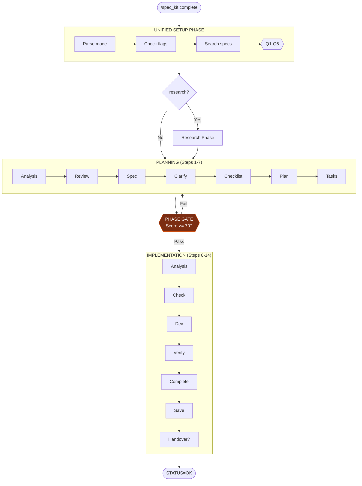
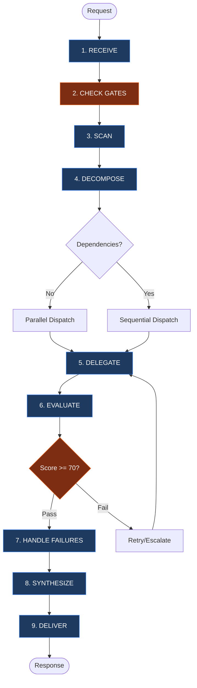

# Refined Recommendations: Agent System Improvements

**Document ID**: REC-AGENT-2026-01-REFINED
**Status**: Complete
**Date**: 2026-01-27
**Research**: 10 parallel Opus agents analyzed all aspects

---

<!-- ANCHOR:executive-summary -->
## Executive Summary

After deep research across all agent, command, and skill files plus online best practices, we identified **4 original recommendations refined** and **5 new improvements** discovered. All are documentation/instruction changes - no new systems or agents.

**Scope**: Agent files, command files, skill files only. AGENTS.md is out of scope.

**Total: 9 targeted improvements organized by priority.**

---

<!-- /ANCHOR:executive-summary -->


<!-- ANCHOR:part-a-original-4-recommendations-refined -->
## PART A: Original 4 Recommendations (Refined)

### 1. Add Mermaid Workflow Diagrams [REFINED]

**Research Finding**: Ready-to-use diagrams designed for complete.md and orchestrate.md with exact placement locations.

**For .opencode/command/spec_kit/complete.md** - Insert after Section 3 "WORKFLOW OVERVIEW" (~line 547):



**For .opencode/agent/orchestrate.md** - Insert after Section 1 "CORE WORKFLOW" (~line 46):



**Effort**: 1-2 hours | **Impact**: HIGH

---

### 2. Strengthen Completion Verification [REFINED]

**Research Finding**: research.md is missing HARD BLOCK verification (speckit.md and write.md have it). Gap identified and specific text provided.

**Add to research.md** after line 578 (after Quality Metrics table):

```markdown
---

### HARD BLOCK: Completion Verification

**CRITICAL**: Before claiming research complete, pass ALL gates:

```
GATE 1: Artifact Existence
□ research.md file exists (Read tool verification)
□ memory/*.md file created (Step 9 completed)

GATE 2: Content Quality
□ No placeholder text ([TODO], [TBD], [Research needed])
□ All 17 sections have content
□ Citations present for all claims

GATE 3: Checklist Integration (Level 2+)
□ Load spec folder's checklist.md
□ Mark relevant items [x] with evidence
□ P0 items MUST be complete

If ANY gate fails → Fix first, THEN claim completion
```

#### Anti-Hallucination Rules

| Rule                                                                              | Enforcement |
| --------------------------------------------------------------------------------- | ----------- |
| NEVER claim "Research Complete" without Read verification that research.md exists |
| NEVER claim memory saved without verifying memory/*.md file exists                |
| NEVER skip checklist.md verification if spec folder exists (Level 2+)             |
```

**Effort**: 30 min | **Impact**: HIGH

---

### 3. Add Pre-Delegation Reasoning [REFINED]

**Research Finding**: orchestrate.md has task decomposition but no mandatory reasoning BEFORE dispatch. Designed minimal 4-line protocol.

**Add to orchestrate.md Section 11** after line 377 (before Example Decomposition):

```markdown
### Pre-Delegation Reasoning (PDR)

**MANDATORY** before EVERY Task tool dispatch:

```
PRE-DELEGATION REASONING [Task #N]:
├─ Intent: [What does this task accomplish?]
├─ Agent: @[agent] → Because: [cite Section 4 or 15]
├─ Parallel: [Yes/No] → Because: [data dependency]
└─ Risk: [Low/Medium/High] → [If High: fallback agent]
```

**Rules:**
- Maximum 4 lines (no bloat)
- Must cite Section 4 (Agent Selection Matrix) or Section 15 (Routing Logic)
- High risk requires fallback agent specification
```

**Also add to Section 7 checklist:**
```
□ Pre-Delegation Reasoning documented for each task dispatch
```

**Effort**: 30 min | **Impact**: MEDIUM

---

### 4. Fix Naming Inconsistencies [REFINED]

**Research Finding**: Only ONE significant inconsistency found: `@documentation-writer` in orchestrate.md vs `@write` everywhere else.

**Edits for orchestrate.md:**

| Line | Old                                             | New                              |
| ---- | ----------------------------------------------- | -------------------------------- |
| 96   | `@documentation-writer - The Quality Publisher` | `@write - The Quality Publisher` |
| 138  | `@documentation-writer`                         | `@write`                         |
| 154  | `@documentation-writer`                         | `@write`                         |
| 809  | `@documentation-writer (docs)`                  | `@write (docs)`                  |

**Effort**: 15 min | **Impact**: MEDIUM

---

<!-- /ANCHOR:part-a-original-4-recommendations-refined -->


<!-- ANCHOR:part-b-new-recommendations-from-research -->
## PART B: New Recommendations from Research

### 5. Add OUTPUT VERIFICATION to speckit.md [NEW]

**Source**: Agent instruction quality analysis - speckit is missing this critical section

**Add to speckit.md** as new Section 12:

```markdown
## 12. OUTPUT VERIFICATION

### Pre-Completion Verification Checklist

```
FILE VERIFICATION (MANDATORY):
□ All spec folder files created (spec.md, plan.md, tasks.md)
□ Validation script run: validate.sh exit code 0
□ No placeholder text remains ([PLACEHOLDER], [TODO])
□ Level-appropriate files present (checklist.md for Level 2+)
```

### Anti-Hallucination Rules

| Rule                                                   | Enforcement |
| ------------------------------------------------------ | ----------- |
| NEVER claim completion without validate.sh exit code 0 |
| NEVER leave placeholder text in any file               |
```

**Effort**: 20 min | **Impact**: HIGH

---

### 6. Add OUTPUT VERIFICATION to orchestrate.md [NEW]

**Source**: Agent instruction quality analysis - orchestrate is missing self-verification

**Add to orchestrate.md** as new Section 25:

```markdown
## 25. OUTPUT VERIFICATION

### Pre-Synthesis Verification Checklist

```
VERIFICATION (MANDATORY):
□ All sub-agent outputs reviewed against Section 7 checklist
□ No fabricated file paths in synthesis
□ Quality scores backed by Section 7 verification
□ Rejected outputs noted (not hidden)
□ Attribution inline for all sources
```

### The Iron Law
> NEVER SYNTHESIZE WITHOUT VERIFICATION
```

**Effort**: 15 min | **Impact**: HIGH

---

### 7. Add Task Description Template Enhancement [NEW]

**Source**: Anthropic multi-agent research - "vague tasks caused subagents to duplicate work"

**Enhance orchestrate.md Section 11** task format:

```markdown
TASK #N: [Descriptive Title]
├─ Objective: [WHY this task exists]          ← NEW
├─ Scope: [Explicit inclusions AND exclusions]
├─ Boundary: [What this agent MUST NOT do]    ← NEW
├─ Agent: @general | @explore | ...
├─ Output Format: [Structured format with example]
├─ Success: [Measurable criteria with evidence requirements]
├─ Depends: [...]
└─ Scale: [1-agent | 2-4 agents | 10+ agents] ← NEW
```

**Effort**: 20 min | **Impact**: MEDIUM

---

### 8. Add Scaling Heuristics [NEW]

**Source**: Anthropic found 50-agent over-spawn for simple queries

**Add to orchestrate.md** as new section:

```markdown
## XX. SCALING HEURISTICS

| Task Type                   | Agent Count | Criteria                    |
| --------------------------- | ----------- | --------------------------- |
| Simple fact-finding         | 1 agent     | Single source, clear answer |
| Comparison/analysis         | 2-4 agents  | Multiple perspectives       |
| Complex research            | 5-10 agents | Multi-domain exploration    |
| Comprehensive investigation | 10+ agents  | Breadth-first, many sources |

**Anti-Pattern:** Early agents spawned 50 subagents for simple queries. Use these heuristics to prevent waste.
```

**Effort**: 15 min | **Impact**: MEDIUM

---

### 9. Minor Command File Fixes [NEW]

**Source**: Command pattern analysis found 3 small issues

| File         | Line | Issue                         | Fix                          |
| ------------ | ---- | ----------------------------- | ---------------------------- |
| research.md  | 72   | Duplicate Q5                  | Change to Q6                 |
| debug.md     | 70   | Incomplete text "for default" | "or leave blank for default" |
| implement.md | 90   | Incomplete text "for default" | "or leave blank for default" |

**Effort**: 10 min | **Impact**: LOW

---

<!-- /ANCHOR:part-b-new-recommendations-from-research -->


<!-- ANCHOR:priority-summary -->
## Priority Summary

### Immediate (< 30 min)

| #   | Recommendation                      | Effort | Impact |
| --- | ----------------------------------- | ------ | ------ |
| 4   | Fix @write naming in orchestrate.md | 15 min | MEDIUM |
| 9   | Minor command fixes                 | 10 min | LOW    |

### This Week (3-4 hours)/s

| #   | Recommendation                                 | Effort | Impact |
| --- | ---------------------------------------------- | ------ | ------ |
| 1   | Mermaid diagrams (complete.md, orchestrate.md) | 1-2 hr | HIGH   |
| 2   | research.md HARD BLOCK verification            | 30 min | HIGH   |
| 5   | speckit.md OUTPUT VERIFICATION                 | 20 min | HIGH   |
| 6   | orchestrate.md OUTPUT VERIFICATION             | 15 min | HIGH   |

### Next Week (1-2 hours)

| #   | Recommendation                        | Effort | Impact |
| --- | ------------------------------------- | ------ | ------ |
| 3   | Pre-delegation reasoning protocol     | 30 min | MEDIUM |
| 7   | Task description template enhancement | 20 min | MEDIUM |
| 8   | Scaling heuristics                    | 15 min | MEDIUM |

---

<!-- /ANCHOR:priority-summary -->


<!-- ANCHOR:what-not-to-do-confirmed-by-research -->
## What NOT to Do (Confirmed by Research)

| Don't                       | Why (Evidence)                          |
| --------------------------- | --------------------------------------- |
| Add hooks                   | Can't implement in this environment     |
| Add new agents              | 7 is sufficient, more adds confusion    |
| Add category routing        | Complexity without proportional benefit |
| Add workflow engine         | Gates already work                      |
| Add visual multi-agent tmux | Overkill for this scale                 |
| Touch AGENTS.md             | Out of scope for this spec              |

---

<!-- /ANCHOR:what-not-to-do-confirmed-by-research -->


<!-- ANCHOR:sources -->
## Sources

**Primary (Local Analysis):**
- All 7 agent files analyzed
- All 11 command files analyzed
- All 3 primary SKILL.md files analyzed
- AGENTS.md structure analyzed

**External (Web Research):**
- [Anthropic Multi-Agent Research System](https://www.anthropic.com/engineering/multi-agent-research-system)
- [GitHub AGENTS.md Best Practices](https://github.blog/ai-and-ml/github-copilot/how-to-write-a-great-agents-md-lessons-from-over-2500-repositories/)
- [Claude Prompt Engineering Docs](https://platform.claude.com/docs/en/docs/build-with-claude/prompt-engineering/)
- [Deloitte AI Agent Orchestration 2026](https://www.deloitte.com/us/en/insights/industry/technology/technology-media-and-telecom-predictions/2026/ai-agent-orchestration.html)
- [Microsoft AI Agent Design Patterns](https://learn.microsoft.com/en-us/azure/architecture/ai-ml/guide/ai-agent-design-patterns)

<!-- /ANCHOR:sources -->
